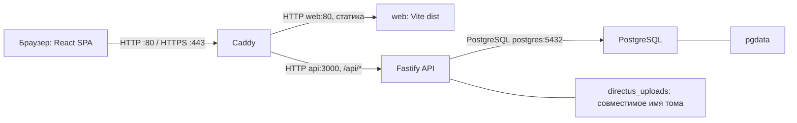

# Клуб выпускников факультета права НИУ ВШЭ

**Сообщество выпускников · Мероприятия · Личный кабинет**

[](https://www.typescriptlang.org/docs/) [](https://nodejs.org/docs/latest-v24.x/api/) [](https://18.react.dev/) [](https://v7.vite.dev/) [](https://fastify.dev/docs/latest/) [](https://www.postgresql.org/docs/16/) [](https://caddyserver.com/docs/) [](https://docs.docker.com/compose/) [](https://documentation.ubuntu.com/server/)

Сайт объединяет новости и мероприятия Клуба, каталог ДПО и мерча, личный кабинет
выпускника и панель учебного офиса. Заявки сохраняются на сервере; онлайн-оплата
включается отдельно при настройке ЮKassa.

**Статус:** переход на Fastify/PostgreSQL и панель офиса реализован и проверен
в изолированном Docker-стеке и на Ubuntu. Отдельная CMS-подписка не требуется.
Стенды используют синтетические данные.
Публичный запуск не выполнен. Точная версия стенда, завершённые проверки и открытые
вопросы ведутся в одном [журнале состояния](docs/project-state.md). Бейджи выше
показывают используемые технологии, а не результат проверки безопасности.

## Быстрый старт

На компьютере разработчика нужны Git, Node.js 24 и pnpm 9.12.0. Команды ниже
выполняются обычным пользователем в новом каталоге; они устанавливают зависимости,
собирают код и запускают модульные тесты. Почта, платежи и бот не запускаются.

```bash
git clone https://github.com/Bogolubov-creator/hse-law-alumni-club.git club
cd club
git checkout --detach a5344689794eae9e3e4d181dd0b5f6b8f2f2c7f4
pnpm install --frozen-lockfile
pnpm -r build
pnpm -r test
```

До объединения PR `main` содержит прежний стек: команда checkout выбирает
проверяемый нативный код. Актуальные PR и доказательства – в журнале состояния.
Ожидаемый результат – код завершения `0` у каждой команды. Тесты, требующие
PostgreSQL, запускаются отдельно. Для работающего сайта продолжите по
[локальному запуску](#локальный-запуск), для серверной репетиции – по
[инструкции Ubuntu](docs/deploy-runbook.md). Рабочие секреты в репозиторий не входят.

## Оглавление

1. [Что делает Клуб](#что-делает-клуб)
2. [Пользователи, роли и права](#пользователи-роли-и-права)
3. [Основные разделы и сценарии](#основные-разделы-и-сценарии)
4. [Технологии и назначение компонентов](#технологии-и-назначение-компонентов)
5. [Как всё работает](#как-всё-работает)
6. [Структура репозитория](#структура-репозитория)
7. [Требования к серверу](#требования-к-серверу)
8. [Сеть, домены и порты](#сеть-домены-и-порты)
9. [Конфигурация и секреты](#конфигурация-и-секреты)
10. [Локальный запуск](#локальный-запуск)
11. [Установка на Ubuntu](#установка-на-ubuntu)
12. [Первый запуск и администратор](#первый-запуск-и-администратор)
13. [HTTPS и сертификаты](#https-и-сертификаты)
14. [Данные и постоянные хранилища](#данные-и-постоянные-хранилища)
15. [Внешние интеграции](#внешние-интеграции)
16. [Фоновые задачи](#фоновые-задачи)
17. [Обновление и миграции](#обновление-и-миграции)
18. [Резервное копирование](#резервное-копирование)
19. [Восстановление и откат](#восстановление-и-откат)
20. [Мониторинг и журналы](#мониторинг-и-журналы)
21. [Безопасность](#безопасность)
22. [Разработка и тестирование](#разработка-и-тестирование)
23. [GitHub, CI и выпуск версий](#github-ci-и-выпуск-версий)
24. [Если что-то пошло не так](#если-что-то-пошло-не-так)
25. [Известные ограничения](#известные-ограничения)

## Что делает Клуб

- Публикует новости, мероприятия, программы ДПО, товары и подкасты.
- Принимает регистрацию, подтверждение почты и заявки на верификацию выпускников.
- Хранит профиль, заявки, баллы, достижения и связи с другими выпускниками.
- Позволяет офису обрабатывать заявки, редактировать контент и вести участников.
- Поддерживает Telegram Mini App и PWA; внешние каналы включаются конфигурацией.

В корзине оформляется заявка. Цену, скидку и доступность позиции перед сохранением
проверяет API. Скидка выпускника применяется к ДПО, а не ко всему содержимому корзины.

## Пользователи, роли и права

| Пользователь | Доступ |
|---|---|
| Гость | Публичные разделы, корзина, регистрация и восстановление доступа |
| Выпускник | Свой профиль, заявки, баллы, события и доступные материалы; верификация влияет на функции сообщества и привилегии |
| `editor` | Контент, обзор, чтение участников и заявок, обработка статусов заявок через панель офиса |
| `admin` / `Administrator` | Панель офиса, операции с баллами и скидками, верификация, чувствительные выгрузки, поддержка и административные действия |
| `club_api` | SQL-роль API для данных, auth и файлов; без создания ролей и доступа к архиву CMS-настроек |
| Оператор сервера | Миграции, bootstrap и управление сотрудниками через закрытые команды |

Полномочия сотрудника проверяются по текущему status и роли в PostgreSQL. Детали – в
[архитектуре](docs/architecture.md#роли-и-границы-доверия). Статус `verified` выпускника
не даёт административных прав. Имена ролей важны для серверных проверок.

## Основные разделы и сценарии

| Раздел | Маршруты | Сценарий |
|---|---|---|
| Публичный сайт | `/`, `/news`, `/news/:slug` | Просмотр главной и публикаций |
| Образование и мерч | `/dpo`, `/dpo/:slug`, `/merch`, `/merch/:slug`, `/cart` | Каталог, корзина, создание заявки, просмотр её статуса |
| Мероприятия | `/events`, `/events/:eventId` | Анонс, регистрация участника и календарь |
| Материалы | `/podcasts`, `/podcasts/:id`, `/changes`, `/saved` | Подкасты, дайджест и сохранённые материалы |
| Доступ | `/join`, `/confirm`, `/forgot`, `/reset` | Регистрация, подтверждение адреса, вход и сброс пароля |
| Кабинет | `/lk`, `/lk/profile` | Профиль, заявки, баллы, достижения и сообщество |
| Офис | `/admin/*` | Работа с участниками, заявками, контентом и медиа |
| Поддержка и сведения | `/support`, `/support/consent`, `/privacy`, `/confidential`, `/requisites` | Поддержка при включении и сведения об операторе |
| Мобильный вход | `/tg`, главная в Mini App/PWA | Мобильная оболочка тех же серверных функций |

Источник маршрутов – [App.tsx](apps/web/src/App.tsx). Префиксы `/v2` и `/legacy`
обрабатываются переходами к каноническим адресам. Проверки сценариев перечислены в
[журнале состояния](docs/project-state.md).

## Технологии и назначение компонентов

Версии ниже взяты из lockfile и конфигурации контейнеров. Диапазон в `package.json`
может отличаться от фактически установленной версии.

| Компонент | Версия | Назначение |
|---|---|---|
| TypeScript | 5.9.3 | Типы API, интерфейса, общих функций и bootstrap |
| Node.js / pnpm | 24.21.0 в Docker и CI / 9.12.0 | Выполнение API, сборка и воспроизводимая установка |
| React / Router / TanStack Query | 18.3.1 / 7.18.4 / 5.104.0 | Интерфейс, маршруты и состояние серверных запросов |
| Vite / Tailwind CSS | 7.3.6 / 3.4.19 | Сборка статических файлов и стили |
| Fastify / Zod | 5.12.5 / 3.25.76 | HTTP API и валидация |
| pg / Argon2 | 8.23.0 / 0.45.1 | Параметризованные SQL-запросы и проверка хешей паролей |
| sharp | 0.35.5 | Декодирование и безопасная выдача аватара 256×256 |
| PostgreSQL | 16.15 | Постоянные данные и транзакции |
| Caddy | 2.11.4 | HTTPS, прокси и выдача статических файлов |
| Vitest / Playwright | 5.0.2 / 1.63.0 | Модульные, интеграционные и браузерные проверки |
| Docker Compose / Ubuntu | Проверяемые версии стенда – в журнале | Контейнеры и серверная ОС |
| GitHub Actions | [ci.yml](.github/workflows/ci.yml) | Автоматические проверки коммитов и PR |

Сроки поддержки и совместимость – в [архитектуре](docs/architecture.md#версии-и-совместимость).
Сборка использует поддерживаемую линию Vite 7.3 с Rollup. Обновления major-версий
React, Router и Tailwind рассматриваются отдельно. Отказ от Directus согласован
в [ADR выбора CMS](docs/cms-options.md); приложение обслуживает данные через SQL.

## Как всё работает



Полная [схема Ubuntu](docs/architecture.md) показывает сборку, файловое хранилище,
интеграции, фоновые задачи, сертификаты, резервные копии и изменение эксплуатации.
PostgreSQL остаётся контейнером. Внутри Docker сервисы обращаются друг к другу по
именам; `127.0.0.1` означает текущий контейнер.

## Структура репозитория

```text
apps/
  api/
    src/routes/       HTTP-маршруты и права доступа
    src/lib/          транзакции, интеграции, фоновые задачи
    migrations/       SQL-миграции приложения
  web/
    src/pages/        публичные страницы и кабинет
    src/admin/        панель офиса
    src/components/   общие компоненты
    e2e/              сценарии Playwright
packages/shared/src/  модели, схемы, расчёты, справочники
packages/server-auth/ серверная проверка и создание хешей паролей
scripts/              bootstrap, выпуск, копии, восстановление, проверки
infra/                Caddy, индексы и systemd
.github/workflows/    CI
docs/                 архитектура, эксплуатация, проверки и источники
```

[AGENTS.md](AGENTS.md) задаёт правила изменений, [DESIGN.md](DESIGN.md) – решения
интерфейса. [CONTEXT.md](CONTEXT.md) служит коротким указателем для нового участника.
Справочники и инструкции собраны в [навигации документации](docs/README.md).

## Требования к серверу

| Контур | Известная конфигурация | Основание |
|---|---|---|
| Разработка | Node.js 24, pnpm 9.12.0, Docker для интеграционных проверок | Версии проекта |
| Локальная Ubuntu-репетиция | Ubuntu 24.04 ARM64, 4 vCPU, 6 GiB RAM, диск 20 GiB | Исходный стенд; не оценка предельной нагрузки |
| Рабочий сервер | Подбирается по объёму данных и нагрузке | [Расчёт ёмкости](docs/capacity.md) |

Размер диска включает ОС, данные, журналы, копии, старые и новые образы, кэш сборки
и свободное место для обновления. Минимум запуска и запас под аудиторию различаются.
Методика измерений, ограничения amd64/arm64 и роль swap – в [capacity.md](docs/capacity.md).

## Сеть, домены и порты

| Порт хоста | Назначение | Доступ |
|---|---|---|
| `22/tcp` | SSH оператора | Только разрешённые адреса оператора |
| `80/tcp`, `443/tcp` | Caddy: сайт и прежний домен администрирования | В рабочем контуре – пользователи; в QA публикация ограничивается override |
| `127.0.0.1:8081` | Перенаправление в `/admin` через Caddy | Только локальный оператор |
| `3000`, `5432` | API и PostgreSQL | Только Docker-сеть; на хосте не публикуются |

`WEB_DOMAIN` и `PUBLIC_URL` задают сайт; `ADMIN_DOMAIN` сохраняет прежние ссылки
на файлы и перенаправляет вход в `/admin`. Порта CMS больше нет. Полная таблица сервисов и проверок – в
[архитектуре](docs/architecture.md#сервисы-и-хранилища).

## Конфигурация и секреты

Рабочий файл хранится в `/etc/club/runtime.env`, принадлежит `root` и имеет права
`0600`. Шаблон [.env.example](.env.example) не содержит пригодной рабочей конфигурации.
В локальной разработке также используйте отдельный файл вне репозитория.

[Справочник переменных](docs/configuration.md) содержит назначение, обязательность,
секретность, безопасные примеры и различие сборки/запуска. `VITE_*` попадают в браузер,
поэтому секреты в них запрещены. Изменение публичных адресов требует пересборки `web`.

## Локальный запуск

Для сайта нужен весь стек: PostgreSQL, миграции, bootstrap, API, `web` и
Caddy. Запуск одного Vite не проверяет сохранение данных или работу интеграций.

Порядок подготовки изолированного контура – в [runbook](docs/deploy-runbook.md).
Для разработки допускается `APP_ENV=development`; синтетические демо-аккаунты
создаются только при `SEED_DEMO=true`. Для безопасной репетиции внешние интеграции
оставляют выключенными, SMTP направляют в локальный Mailpit, фоновые импорты
отключают. Существующий сценарий виртуальной машины описан в
[ubuntu-vm-rehearsal.md](docs/ubuntu-vm-rehearsal.md); актуальная проверенная версия
всегда указана в [журнале состояния](docs/project-state.md).

## Установка на Ubuntu

Используется один путь установки и обновления: [scripts/deploy.sh](scripts/deploy.sh)
с предварительной проверкой [scripts/preflight.sh](scripts/preflight.sh).
Пакеты Ubuntu, Docker, файл окружения, права и точные команды перечислены в
[runbook](docs/deploy-runbook.md).

Принятые пути: `/opt/club` – код, `/etc/club` – конфигурация,
`/var/backups/club` – копии, `/var/lib/club-ops` – состояние обслуживания.
Операции Docker и системных таймеров выполняет `root` через `sudo`.

## Первый запуск и администратор

`migrate` создаёт и дополняет схему PostgreSQL, применяет индексы и права SQL-роли.
Затем [native-bootstrap.ts](scripts/src/native-bootstrap.ts) создаёт отсутствующие
роли, администратора из `ADMIN_EMAIL`/`ADMIN_PASSWORD`, справочники и главную страницу.
API стартует только после успешного завершения обоих шагов.

Повторный bootstrap сохраняет UUID, пароль, роль, настройки и редакторские изменения.
Изменение `ADMIN_PASSWORD` не сбрасывает существующий пароль. Создание сотрудника и
восстановление его пароля выполняет оператор через
[manage-staff.ts](scripts/src/manage-staff.ts), с подключением владельца БД и паролем
через stdin. Публичное восстановление предназначено только для alumni. Команды и
проверка повторного запуска – в [runbook](docs/deploy-runbook.md).

## HTTPS и сертификаты

В локальном HTTP-контуре используются `WEB_DOMAIN=:80` и `ADMIN_DOMAIN=:8081`.
В рабочем контуре Caddy получает сертификаты для доменных имён и продлевает их;
данные ACME и ключи остаются в томе `caddy_data`.

Для локального HTTPS нужен доверенный тестовый CA. `HTTPS_CA_FILE` передаёт его
операционным проверкам. `curl -k` не подтверждает корректность TLS. В API-сессиях
используется Bearer JWT. HTTPS, редиректы, CSP и доверенные прокси проверяются
отдельно по [runbook](docs/deploy-runbook.md).

## Данные и постоянные хранилища

| Хранилище | Содержимое |
|---|---|
| `pgdata` | PostgreSQL: участники, заявки, контент, баллы, события и служебные таблицы |
| `directus_uploads` | Файлы API; прежнее имя тома сохранено для совместимости |
| `caddy_data` | Сертификаты, закрытые ключи и данные ACME |
| `caddy_config` | Состояние конфигурации Caddy |
| `/etc/club/runtime.env` | Рабочая конфигурация и секреты |
| `/var/backups/club` | Зашифрованные наборы резервного копирования |

Имена `directus_users`, `directus_roles`, `directus_files` и `directus_uploads`
сохранены для совместимости UUID, связей и загрузок; сервер CMS не запускается.
Полные старые настройки хранятся приватно в `club_settings`, вне доступа API.

Compose добавляет к именам томов имя проекта. Пересборка контейнера не должна
удалять тома. Команды удаления томов не входят в обычное обновление. Порядок хранения
ключей отдельно от копий и восстановления – в [runbook](docs/deploy-runbook.md).

## Внешние интеграции

| Интеграция | Включение и граница проверки |
|---|---|
| SMTP | Обязателен в `APP_ENV=production`; в QA письма перехватывает Mailpit |
| ЮKassa | Пара ключей магазина; без них заявки работают без онлайн-оплаты |
| Telegram | Токен бота, отдельный webhook secret либо локальный polling; офисные уведомления настраиваются отдельно |
| Web Push | Пара VAPID-ключей и разрешение пользователя |
| HSE ДПО / источники новостей | Серверные импорты, отдельные флаги включения; полученный материал требует редакционной проверки |
| Sentry | `SENTRY_DSN`; пустое значение отключает отправку |
| Offsite | Проверенное назначение rclone; пустое значение означает только локальное хранение |

Назначение переменных и адресов – в [configuration.md](docs/configuration.md).
Наличие реализации не подтверждает оплату, доставку письма или сообщения.

## Фоновые задачи

При одном экземпляре API `node-cron` обслуживает баллы, импорты, напоминания,
очистку по сроку хранения, истечение резервов и почтовую очередь. Расписания заданы
в часовом поясе `Europe/Moscow`; общий выключатель – `JOBS_ENABLED=false`.

Ежедневное обслуживание копий запускает один `systemd` timer в 03:30
`Europe/Moscow` с `Persistent=true`. Второй timer запускает мониторинг. Параллельный
старый cron для тех же операций не устанавливают. Полный перечень и поведение
после ошибки – в [архитектуре](docs/architecture.md#фоновые-задачи) и
[runbook](docs/deploy-runbook.md).

## Обновление и миграции

Обновляется конкретный проверенный коммит. Скрипт проверяет конфигурацию и собирает
новую версию; перед изменением данных фиксируются исходная версия и резервная копия.
Затем выполняются миграции, bootstrap, запуск и проверка через Caddy. Ненулевой код
завершения требует диагностики.

SQL лежит в [apps/api/migrations](apps/api/migrations), индексы – в
[infra/indexes.sql](infra/indexes.sql). Совместимость миграций со старым кодом
оценивается в PR. Полный порядок – в [runbook](docs/deploy-runbook.md).

## Резервное копирование

[scripts/backup.sh](scripts/backup.sh) готовит один согласованный набор:
PostgreSQL, uploads и сведения о версии. Используются блокировка,
промежуточное имя, контрольные суммы и ограниченные права. Для согласования БД и
файлов предусмотрено окно остановки записи; его учитывают при выборе расписания.

Локальная копия не защищает от потери сервера. Offsite и чтение из него проверяются
отдельно. Политика хранения, шифрование, права и команды – в
[runbook](docs/deploy-runbook.md). Факт успешного восстановления указан только в
[журнале состояния](docs/project-state.md).

## Восстановление и откат

[scripts/restore.sh](scripts/restore.sh) предназначен для изолированного проекта
Compose с новыми томами. Проверяются данные, файлы, вход и повторное чтение через
приложение. Восстановление рабочей БД поверх существующей не является безопасной
репетицией.

Откат кода и восстановление данных – разные операции. Запуск старого образа после
несовместимой миграции не откатывает схему. Решение и точные команды для конкретного
релиза описываются в PR и [runbook](docs/deploy-runbook.md).

## Мониторинг и журналы

[scripts/monitor.sh](scripts/monitor.sh) и таймер обслуживания проверяют состояние
контура. API даёт `/api/health` для живого процесса и `/api/ready` для готовности
зависимостей. Docker ограничивает размер журналов каждого сервиса; результаты
системных задач доступны через `journalctl`.

Пороги диска, возраста копии и срока TLS, проверка OOM, периодичность и ответственный
описаны в [runbook](docs/deploy-runbook.md). Пока канал оповещений не настроен и не
проверен, журналы и код завершения команды остаются локальными сигналами.

## Безопасность

Цены, права и операции с данными проверяются сервером. Хеши паролей, секреты JWT,
пароли БД и ключи интеграций доступны только серверным компонентам. Вебхук ЮKassa
проверяет отправителя, затем статус и сумму через API провайдера.

API и PostgreSQL не имеют опубликованных портов. Caddy задаёт ограничения запросов
и заголовки; API применяет валидацию, лимиты и проверки доступа. Bearer-токены в
браузере требуют защиты от XSS. Аудит зависимостей, роли, секреты, восстановление и
проверки реального контура дополняют друг друга; результат любой одной проверки
не означает отсутствие всех рисков.

Границы и ограничения – в [архитектуре](docs/architecture.md), требования к
конфигурации – в [справочнике](docs/configuration.md). Технические механизмы работы
с персональными данными и проверки перед запуском описаны в
[документе о данных](docs/152fz-compliance.md); сведения об операторе подтверждает владелец.

## Разработка и тестирование

Команды выполняются обычным пользователем из корня клона после установки Node.js 24
и pnpm 9.12.0. Docker Engine нужен для последней команды. Ожидаемый результат у
каждой команды – код `0`; сценарий PostgreSQL создаёт отдельную тестовую БД.

```bash
pnpm install --frozen-lockfile
pnpm lint
pnpm -r build
pnpm -r test
pnpm audit --prod --audit-level high
node scripts/check-web-build.mjs apps/web/dist
docker compose --env-file .env.example config --quiet
bash scripts/test-integration.sh
```

Сборка включает TypeScript. Часть route-тестов подменяет SQL-хранилище и внешних
провайдеров; они не доказывают сохранение в БД. PostgreSQL-интеграция использует
настоящие миграции; браузерная цепочка запускается с собранными API, web и БД. Playwright запускают только против указанного тестового
контура: некоторые сценарии изменяют данные. Команды и фактические прогоны – в
[журнале состояния](docs/project-state.md) и [runbook](docs/deploy-runbook.md).
Отдельные проверки обычного web-бандла и содержимого финальных контейнеров
описаны в [testing.md](docs/testing.md#содержимое-выпуска).

## GitHub, CI и выпуск версий

Изменения готовятся в небольших ветках `codex/...` и PR. Основной workflow –
[CI](.github/workflows/ci.yml); результаты всегда сверяются с SHA проверяемого коммита.
В workflow включены установка по lockfile, линтер, типы, сборка, модульные тесты,
аудит, PostgreSQL-интеграция и сборка контейнеров с настоящей браузерной цепочкой.
Наличие шага не подтверждает его успешный запуск: результат берётся из CI нужного SHA.
Защита `main` и обязательные проверки описаны в [журнале состояния](docs/project-state.md).
Изменение workflow не меняет правила защиты ветки автоматически.

Описание выпуска должно содержать версию и SHA, изменения, миграции, новые
переменные, совместимость данных, команды обновления и отката, среду и результаты
проверок. История изменений сохраняется в Git и PR; подтверждение проверенного
состояния – в [журнале состояния](docs/project-state.md). Слияние PR и публикация
требуют отдельного поручения владельца.

## Если что-то пошло не так

Команды диагностики выполняет оператор на Ubuntu из `/opt/club` с рабочим внешним
env. Полные варианты команд с `sudo` и override – в [runbook](docs/deploy-runbook.md).

| Симптом | Проверка | Действие | Ожидаемый результат | Следующий шаг |
|---|---|---|---|---|
| Сайт недоступен | Порты, `compose ps`, журнал Caddy | Устранить конфликт порта или ошибку домена | Caddy принимает запрос с нужным Host | Проверить `/api/ready` |
| `502` или `503` | API, PostgreSQL, результаты `migrate` и `bootstrap` | Исправить упавшую зависимость или конфигурацию | Готовность API `200` | Пройти пользовательский сценарий |
| Вход не работает | Подтверждение адреса, статус пользователя, SMTP | Проверить письмо в тестовом приёмнике или доставку SMTP | Пользователь входит своей ролью | Проверить отказ чужой роли |
| Регистрация без письма | SMTP и почтовая очередь | Исправить отправителя/доступ к SMTP | Письмо доставлено и ссылка работает | Повторно проверить вход |
| TLS не доверен | Имя, цепочка, часы, срок сертификата | Подключить тестовый CA либо исправить DNS/ACME | HTTPS проходит без `-k` | Проверить HTTP-редирект |
| Копия устарела | Timer, journal, место, ключ, последняя успешная запись | Устранить причину и повторить копию | Новый завершённый набор с контрольными суммами | Изолированно восстановить |
| После обновления пустой каталог | Публикация контента, выбранная БД, отключённые демо-сиды | Проверить публикацию в панели контента и выбранную БД | API отдаёт ожидаемые публикации | Проверить страницу и права |
| Диск заканчивается | `df`, размеры данных/копий/образов/кэша | Удалить только подтверждённо ненужные артефакты | Достаточный запас на копию и обновление | Повторить preflight |

## Известные ограничения

- Публичное окружение, доставка реальной почты, платежи и внешние уведомления
  проверяются отдельно после согласования сервера и интеграций.
- В API допускается один экземпляр: блокировки фоновых задач и часть состояния
  процесса не рассчитаны на независимые реплики.
- Offsite и канал оповещений нельзя считать настроенными по наличию переменных.
- Совместимость нативного auth/files и обновлённых зависимостей подтверждается конкретными
  прогонами; сроки поддержки сверяются по [официальным источникам](docs/architecture.md#версии-и-совместимость).
- Размер локального стенда и успешный короткий тест не определяют предельную
  вместимость сайта. Нагрузочные допущения указаны в [capacity.md](docs/capacity.md).
- Импортированный контент и исторические материалы не переписываются автоматически;
  авторство, условия использования и реквизиты проверяет владелец.

Точный список незавершённого и доказательства выполненного – в
[docs/project-state.md](docs/project-state.md).
