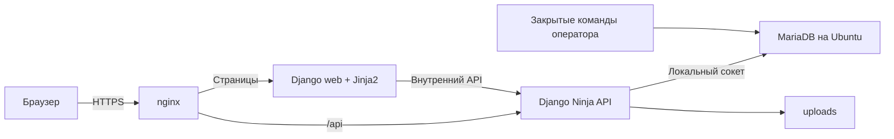

# Клуб выпускников факультета права НИУ ВШЭ

**Сообщество выпускников · Мероприятия · Личный кабинет**

[](#технологии-и-назначение-компонентов)
[](#технологии-и-назначение-компонентов)
[](#технологии-и-назначение-компонентов)
[](#технологии-и-назначение-компонентов)
[](#технологии-и-назначение-компонентов)
[](#технологии-и-назначение-компонентов)
[](#технологии-и-назначение-компонентов)
[](#технологии-и-назначение-компонентов)
[](#технологии-и-назначение-компонентов)

[](https://github.com/Bogolubov-creator/hse-law-alumni-club/actions/workflows/ci.yml?query=branch%3Amain+event%3Apush)

Сайт объединяет новости и мероприятия Клуба, каталог ДПО и мерча, личный кабинет
выпускника и панель учебного офиса. Заявки сохраняются на сервере; онлайн-оплата
включается отдельно при настройке ЮKassa.

**Стек:** Python/Django, Django Ninja, Gunicorn и Jinja2. Страницы сайта, кабинет и панель
офиса формируются на сервере. React и TypeScript удалены; Node.js, npm и pnpm
для установки, сборки и запуска не нужны. JavaScript обслуживает браузерные
действия, плеер, PWA и Telegram. Отдельная CMS-подписка не требуется.

**База и запуск:** новые установки используют MariaDB из Ubuntu и nginx.
Установщик, обновление и копии работают с этим контуром. Данные прежнего
PostgreSQL переносятся по [инструкции](docs/operations/mariadb-migration.md).
Существующая установка PostgreSQL/Caddy сохраняет свой порядок обслуживания.
Vue/TypeScript в проект не возвращены.

**Посмотреть сайт:** [демонстрационное зеркало](https://bogolubov-creator.github.io/club-pravo-hse-mirror/).
Оно собрано из тех же шаблонов и показывает синтетические данные. Отправка заявок,
регистрация, оплата и сохранение серверных правок в зеркале отключены.
Работающее приложение проверено локально на Ubuntu; публичный API-сервер
пока не развёрнут. Версии и результаты – в [журнале состояния](docs/operations/project-state.md).

Бейдж `Security & CI` показывает результат проверок ветки `main`;
состав проверок и пороги – в [разделе «Безопасность»](#безопасность).

> [!TIP]
> **Установка в двух словах:** получить код в `/opt/club` → `sudo ./scripts/install.sh` →
> выбрать локальный стенд или домен с HTTPS → открыть адрес из вывода и войти
> с первичным паролем администратора из защищённого файла. Подробно – в разделе
> [Установка на Ubuntu](#установка-на-ubuntu).

## Оглавление

1. [Быстрый старт](#быстрый-старт)
    - [Проверенная версия](#проверенная-версия)
2. [Что делает Клуб](#что-делает-клуб)
3. [Пользователи, роли и права](#пользователи-роли-и-права)
4. [Основные разделы и сценарии](#основные-разделы-и-сценарии)
5. [Технологии и назначение компонентов](#технологии-и-назначение-компонентов)
6. [Как всё работает](#как-всё-работает)
7. [Структура репозитория](#структура-репозитория)
8. [Требования к серверу](#требования-к-серверу)
9. [Сеть, домены и порты](#сеть-домены-и-порты)
10. [Конфигурация и секреты](#конфигурация-и-секреты)
11. [Локальный запуск](#локальный-запуск)
    - [Посмотреть зеркало локально](#посмотреть-зеркало-локально)
12. [Установка на Ubuntu](#установка-на-ubuntu)
    - [Простая установка](#простая-установка)
    - [Вариант А: ключ развёртывания](#вариант-а-ключ-развёртывания)
    - [Вариант Б: HTTPS](#вариант-б-https)
    - [Вариант В: архив Git](#вариант-в-архив-git)
    - [Подготовка Ubuntu и первый deploy](#подготовка-ubuntu-и-первый-deploy)
    - [Что делает deploy.sh](#что-делает-deploysh)
13. [Первый запуск и администратор](#первый-запуск-и-администратор)
14. [Забытый пароль](#забытый-пароль)
15. [HTTPS и сертификаты](#https-и-сертификаты)
16. [Данные и постоянные хранилища](#данные-и-постоянные-хранилища)
17. [Внешние интеграции](#внешние-интеграции)
18. [Фоновые задачи](#фоновые-задачи)
19. [Обновление и миграции](#обновление-и-миграции)
20. [Резервное копирование](#резервное-копирование)
21. [Восстановление и откат](#восстановление-и-откат)
22. [Мониторинг и журналы](#мониторинг-и-журналы)
23. [Безопасность](#безопасность)
24. [Разработка и тестирование](#разработка-и-тестирование)
25. [GitHub, CI и выпуск версий](#github-ci-и-выпуск-версий)
26. [Если что-то пошло не так](#если-что-то-пошло-не-так)
27. [Известные ограничения](#известные-ограничения)

## Быстрый старт

На компьютере разработчика нужны Git, Python 3.14 и uv.
Команды ниже устанавливают зависимости API, команд оператора и интерфейса,
собирают интерфейс и запускают его модульные тесты. Выполняйте их обычным
пользователем в новом каталоге. Запуск API описан в [локальном запуске](#локальный-запуск),
проверки с PostgreSQL – в [testing.md](docs/development/testing.md).

```bash
git clone https://github.com/Bogolubov-creator/hse-law-alumni-club.git club
cd club
uv sync --directory backend --frozen
uv sync --directory scripts --frozen
uv sync --directory frontend --frozen
uv run --directory frontend playwright install chromium
uv run --directory frontend python -m club_web.build --output /tmp/club-web
uv run --directory frontend python ../scripts/checks/check-web-build.py /tmp/club-web
uv run --directory frontend pytest -q
```

Команды используют основную ветку `main`. Проверенные ревизии, результаты CI
и сведения о локальном стенде – в [журнале состояния](docs/operations/project-state.md).
Ожидаемый результат – код завершения `0` у каждой команды. Тесты, требующие
PostgreSQL, запускаются отдельно. Для работающего сайта продолжите по
[локальному запуску](#локальный-запуск), для серверной репетиции – по
[инструкции Ubuntu](docs/operations/deploy-runbook.md). Рабочие секреты в репозиторий не входят.

### Проверенная версия

Перенос сайта, кабинета и офиса завершён в [PR 69](https://github.com/Bogolubov-creator/hse-law-alumni-club/pull/69).
Версия кода `2f19ee5` от 1 октября 2026 года прошла
[все четыре задания CI](https://github.com/Bogolubov-creator/hse-law-alumni-club/actions/runs/36852313065)
и установлена на локальном Ubuntu-стенде.

| Проверка | Результат этой версии |
|---|---|
| Шаблоны и браузерные сценарии | 106 тестов прошли; live-сценарии запускались отдельно |
| API и операции с PostgreSQL | 92 теста прошли |
| Собственный код | Проверены 226 файлов: комментариев и docstring нет; обязательные лицензии и shebang сохранены |
| Ubuntu после обновления | Через доверенный TLS проверены 22 раздела сайта, 16 разделов офиса и права четырёх ролей |
| Публикация зеркала | 165 страниц из тех же Jinja2-шаблонов; версия источника указана в `version.json` |

Это результаты указанной ревизии. Проверки следующих изменений доступны в CI
по бейджу выше; команды и условия публичного запуска – в
[журнале состояния](docs/operations/project-state.md).

## Что делает Клуб

- Публикует новости, мероприятия, программы ДПО, товары и подкасты.
- Принимает регистрацию, подтверждение почты и заявки на верификацию выпускников.
- Хранит профиль, заявки, баллы, достижения и связи с другими выпускниками.
- Позволяет офису обрабатывать заявки, редактировать контент и вести участников.
- Поддерживает Telegram Mini App и PWA; внешние каналы включаются конфигурацией.
- В PWA можно без интернета читать ранее открытые публичные страницы и пользоваться списком сохранённых материалов. Копии хранятся до семи дней, максимум 60 страниц; дата копии показана над страницей. Для входа, отправки заявок, оплаты и аудио требуется подключение.

В корзине оформляется заявка. Цену, скидку и доступность позиции перед сохранением
проверяет API. Скидка выпускника применяется к ДПО, а не ко всему содержимому корзины.

## Пользователи, роли и права

| Пользователь | Доступ |
|---|---|
| Гость | Публичные разделы, корзина, регистрация и восстановление доступа |
| Выпускник | Свой профиль, заявки, баллы, события и доступные материалы; верификация влияет на функции сообщества и привилегии |
| `editor` | Контент, обзор, чтение участников и заявок, обработка статусов заявок через панель офиса |
| `admin` / `Administrator` | Панель офиса, операции с баллами и скидками, верификация, чувствительные выгрузки, поддержка и административные действия |
| `club_api` | SQL-роль API для данных, auth и файлов; без создания ролей и доступа к архиву CMS-настроек |
| Оператор сервера | Миграции, bootstrap и управление сотрудниками через закрытые команды |

Полномочия сотрудника проверяются по текущему status и роли в базе. Детали – в
[архитектуре](docs/development/architecture.md#роли-и-границы-доверия). Статус `verified` выпускника
не даёт административных прав. Имена ролей важны для серверных проверок.

## Основные разделы и сценарии

| Раздел | Маршруты | Сценарий |
|---|---|---|
| Публичный сайт | `/`, `/news`, `/news/:slug` | Просмотр главной и публикаций |
| Образование и мерч | `/dpo`, `/dpo/:slug`, `/merch`, `/merch/:slug`, `/cart` | Каталог, корзина, создание заявки, просмотр её статуса |
| Мероприятия | `/events`, `/events/:eventId` | Анонс, регистрация участника и календарь |
| Материалы | `/podcasts`, `/podcasts/:id`, `/changes`, `/saved` | Подкасты, дайджест и сохранённые материалы |
| Доступ | `/join`, `/confirm`, `/forgot`, `/reset` | Регистрация, подтверждение адреса, вход и сброс пароля |
| Кабинет | `/lk`, `/lk/profile` | Профиль, заявки, баллы, достижения и сообщество |
| Офис | `/admin/*` | Работа с участниками, заявками, контентом и медиа |
| Поддержка и сведения | `/support`, `/support/consent`, `/privacy`, `/confidential`, `/requisites` | Поддержка при включении и сведения об операторе |
| Мобильный вход | `/tg`, главная в Mini App/PWA | Мобильная оболочка тех же серверных функций |

Источник маршрутов – [pages.py](frontend/club_web/pages.py). Префиксы `/v2` и `/legacy`
обрабатываются переходами к каноническим адресам. Проверки сценариев перечислены в
[журнале состояния](docs/operations/project-state.md).

## Технологии и назначение компонентов

Версии закреплены в `backend/uv.lock`, `frontend/uv.lock`, `scripts/uv.lock`
и Docker-файлах. Решение о переносе сервера – в [ADR Django](docs/decisions/django-migration.md).

| Компонент | Версия | Назначение |
|---|---|---|
| Python / uv | 3.14.7 / 0.12.22 в сборке и CI | Сайт, API, команды оператора и экспорт зеркала; зависимости закреплены в uv.lock |
| Django / Django Ninja / Pydantic | 6.1.1 / 1.7.1 / 2.13.5 | Модели, миграции, HTTP API и проверка запросов |
| Gunicorn | 26.2.0 | ASGI-сервер API и сайта; Uvicorn используется только в тестах web |
| Jinja2 | 3.1.6 | Серверные HTML-шаблоны сайта, кабинета и офиса |
| mysqlclient / Psycopg | 2.3.0 / 3.3.6 | MariaDB и совместимость с прежней PostgreSQL на время перехода |
| bcrypt / Argon2 / PyJWT | 5.0.0 / 25.1.0 / 2.15.1 | BCryptSHA256 для новых паролей, прежние PHC-хеши и JWT-сессии |
| Pillow | 12.3.0 | Проверка медиа и аватары 256×256; multipart принимает Django |
| HTTPX / Beautiful Soup | 0.28.1 / 4.15.0 | Проверяемые внешние запросы и разбор HTML |
| aiosmtplib / pywebpush | 5.1.3 / 2.5.0 | SMTP и Web Push |
| Sentry SDK | 2.71.0 | Только коды ошибок без запросов и персональных данных |
| pytest / Ruff | 9.1.1 / 0.16.10 | Проверки Python, MariaDB и PostgreSQL |
| MariaDB / PostgreSQL | Пакет Ubuntu / 16.15 | Новая установка / совместимость и откат |
| nginx / Caddy | 1.30.5 / 2.11.6 | Новая установка / совместимость и откат |
| Playwright | 1.63.0 | Браузерные проверки на компьютере и ширине телефона; в рабочий образ не входит |
| Docker Compose / Ubuntu | Проверяемые версии стенда – в журнале | Контейнеры и серверная ОС |
| systemd / Bash / Python | Пакеты Ubuntu 24.04 | Таймеры, операции выпуска, проверки конфигурации и копий |
| Git / GitHub Actions | [ci.yml](.github/workflows/ci.yml) | История версий и автоматические проверки коммитов и PR |

Сроки поддержки и совместимость – в [архитектуре](docs/development/architecture.md#версии-и-совместимость).
В браузере используются обычные JavaScript-модули и CSS. Node.js и сборщик
интерфейса для разработки и развёртывания не требуются.
Caddy собирается из официального выпуска с актуальными CEL и automemlimit;
сборка и проверки описаны в [ADR сборки](docs/decisions/caddy-dependencies.md). Отказ от Directus
согласован в [ADR выбора CMS](docs/decisions/cms-options.md); данные обслуживаются через SQL.

## Как всё работает



API, web и nginx запускаются в Docker. MariaDB работает как служба Ubuntu;
сокет подключён к API и оператору. На хост публикуются только порты nginx
и локальный просмотрщик писем в режиме репетиции. Web не получает пароль базы.
API использует отдельный ограниченный аккаунт, оператор – аккаунт для миграций.

Прежний PostgreSQL/Caddy-контур описан в
[runbook совместимости](docs/operations/deploy-runbook.md). Его данные сохраняются
при переносе; установленная версия не переключается автоматически.

## Структура репозитория

```text
backend/
  club_api/urls.py         Django URLconf
  club_api/django_settings.py настройки Django
  club_api/modules/        маршруты и логика по предметным областям
  club_api/db/             SQL-адаптер, схемы данных и транзакции
  club_api/core/           проверка конфигурации приложения
  club_api/jobs/           расписание и хранение данных
  club_api/observability/  аудит, журналы и проверки готовности
  migrations/             SQL-миграции приложения
  sql/                    индексы и права роли API
  tests/python/           pytest, SQL-проверки и фикстуры
  pyproject.toml          зависимости и настройки Python-пакета
  uv.lock                 закреплённые версии зависимостей
frontend/
  club_web/               Django web, клиент API и подготовка страниц
    urls.py, views.py      маршруты и обработчики Django
    templates/            Jinja2: сайт, кабинет и разделы офиса
    browser/              JavaScript-модули браузерных действий
    styles/               CSS и токены дизайна
  public/                 изображения, шрифты, иконки и manifest
  fixtures/               публичные данные статического зеркала
  tests/python/           шаблоны, браузерные сценарии и live-проверки
  pyproject.toml          зависимости и настройки Python-пакета
  uv.lock                 закреплённые версии зависимостей
data/                     единые справочники, FAQ, каталог и архив дайджеста
scripts/                  команды установки, выпуска, копирования и восстановления
  club_ops/               bootstrap, управление сотрудниками и импорты
  lib/                    общие shell/Python-функции операций
  checks/                 проверка сборок и финальных образов
  diagnostics/            диагностика, ресурсы и нагрузка
  tests/                  тесты операций, SQL и live-стек
  pyproject.toml          зависимости команд оператора
  uv.lock                 закреплённые версии зависимостей
deploy/                   Docker-файлы, nginx, прежний Caddy и systemd
.github/workflows/        CI
docs/                     development, operations, product, integrations, decisions
docker-compose.yml        сервисы и постоянные хранилища приложения
```

[AGENTS.md](AGENTS.md) задаёт правила изменений, [DESIGN.md](DESIGN.md) – решения
интерфейса. [docs/development/context.md](docs/development/context.md) служит коротким указателем для нового участника.
Справочники и инструкции собраны в [навигации документации](docs/README.md).
Правила размещения файлов и карта модулей – в [структуре проекта](docs/development/repository-structure.md).

## Требования к серверу

| Контур | Известная конфигурация | Основание |
|---|---|---|
| Разработка | Python 3.14, uv, Docker для интеграционных проверок | Версии проекта |
| Локальная Ubuntu-репетиция | Ubuntu 24.04 ARM64, 4 vCPU, 6 GiB RAM, диск 20 GiB | Исходный стенд; не оценка предельной нагрузки |
| Рабочий сервер | Подбирается по объёму данных и нагрузке | [Расчёт ёмкости](docs/operations/capacity.md) |

Размер диска включает ОС, данные, журналы, копии, старые и новые образы, кэш сборки
и свободное место для обновления. Минимум запуска и запас под аудиторию различаются.
Методика измерений, ограничения amd64/arm64 и роль swap – в [capacity.md](docs/operations/capacity.md).

## Сеть, домены и порты

| Адрес | Назначение |
|---|---|
| `127.0.0.1:9443` | Локальный HTTPS, создаваемый установщиком |
| `127.0.0.1:9080` | Локальный HTTP с переходом на HTTPS |
| `127.0.0.1:8025` | Письма локального стенда в Mailpit |
| `80`, `443` | nginx публичной установки с выбранным доменом и сертификатом |
| `/run/mysqld/mysqld.sock` | API и оператор обращаются к MariaDB |

Порты API и web не публикуются. MariaDB должна слушать TCP только на loopback.
Для доступа к локальному стенду с другого компьютера используйте SSH-туннель;
самоподписанный сертификат требует доверия выданной локальной CA.
Публичный сервер в рамках текущей работы не развёрнут.

## Конфигурация и секреты

Установщик создаёт `/etc/club` с правами `0700`; файлы ниже имеют права `0600`.

| Файл | Содержимое |
|---|---|
| `runtime.env` | Настройки API и пароль его ограниченного аккаунта |
| `operator.env` | Подключение оператора, миграции и первичный bootstrap |
| `compose.env` | Пути данных, образы, порты, адрес сайта и ключ копий |
| `operations.env` | Файл контура для systemd |
| `initial-admin.txt` | Первичные данные входа администратора |
| `install.json` | Тип установки и имена её базы и аккаунтов |

`APP_ENV=production`, `SEED_DEMO=false`, отдельные `AUTH_SECRET` и
`ADMIN_AUTH_SECRET` обязательны. SMTP, ЮKassa, Telegram и push задаются отдельно;
локальная установка не включает внешние платежи и уведомления.
Полный [справочник переменных](docs/development/configuration.md) содержит
настройки бизнес-функций. `.env.example` остаётся примером прежнего Compose;
установщик берёт оттуда значения по умолчанию и заменяет секреты.

Не передавайте env, дампы, uploads и ключи в Git или чат. Пароль оператора
и ключ резервных копий не передаются API. Права API не позволяют менять роли
пользователей и читать `club_settings`.

## Локальный запуск

Для сайта нужны база, миграции, bootstrap, API, `web` и прокси.
Команды ниже сохраняют прежний PostgreSQL-контур для разработки. Для нового
стенда используйте установщик MariaDB. Запуск одного web-сервиса не проверяет
сохранение данных или работу интеграций.

Порядок подготовки изолированного контура – в [runbook](docs/operations/deploy-runbook.md).
Для разработки допускается `APP_ENV=development`; синтетические демо-аккаунты
создаются только при `SEED_DEMO=true`. Для безопасной репетиции внешние интеграции
оставляют выключенными, SMTP направляют в локальный Mailpit, фоновые импорты
отключают. Существующий сценарий виртуальной машины описан в
[ubuntu-vm-rehearsal.md](docs/operations/ubuntu-vm-rehearsal.md); актуальная проверенная версия
всегда указана в [журнале состояния](docs/operations/project-state.md).

### Посмотреть зеркало локально

После клонирования можно открыть интерфейс с синтетическими данными без БД:

```bash
uv sync --directory frontend --frozen
uv run --directory frontend python -m club_web.mirror --output /tmp/club-mirror --base /
uv run --directory frontend python -m http.server 4173 --bind 127.0.0.1 --directory /tmp/club-mirror
```

Откройте `http://127.0.0.1:4173/`. Поиск, фильтры, локальная корзина и просмотр
разделов работают в браузере. Отправка заявок и серверные изменения отключены.
Для проверки входа, прав и сохранения данных нужен полный стек.
Публикация на GitHub Pages и базовый путь описаны в
[инструкции зеркала](docs/integrations/pages-mirror.md).

## Установка на Ubuntu

Проверяемая ОС – Ubuntu 24.04 LTS. Python, Django и библиотеки приложения
устанавливаются внутри образов; Node.js для сборки не нужен.

### Простая установка

В чистом checkout проекта:

```bash
cd /opt/club
sudo ./scripts/install.sh --local
```

Без `--local` мастер предложит локальную репетицию или публичный HTTPS.
Для публичного варианта нужны домен, существующие `fullchain.pem` и `privkey.pem`,
SMTP и адрес администратора. nginx не заказывает сертификат через ACME;
его продление настраивается у выбранного поставщика сертификата.

Установщик ставит Docker и MariaDB, создаёт отдельную базу и два аккаунта,
случайные секреты и сертификат локального стенда. Затем собирает API, web
и оператора, применяет миграции Django и ограничения прав, выполняет bootstrap
и проверяет TLS, главную и `/api/ready`.

Откройте `https://localhost:9443/admin`. Первичные данные входа доступны на сервере:

```bash
sudo cat /etc/club/initial-admin.txt
```

Локальная CA – `/etc/club/local-ca.crt`; письма – `http://localhost:8025`.
Пароль не выводится в журнал. Повторный запуск сохраняет конфигурацию, данные
и пароль. Для отдельной репетиции задайте `--config-dir /etc/club-rehearsal`.
Существующая конфигурация версии 1 обслуживается прежним PostgreSQL/Caddy;
переход выполняется отдельной командой импорта, по
[инструкции переноса](docs/operations/mariadb-migration.md).

### Вариант А: ключ развёртывания

Получите checkout через SSH GitHub с ключом вне рабочей папки.
Используйте ключ с доступом на чтение нужного репозитория. Команды настройки
ключа и проверки GitHub – в [runbook](docs/operations/deploy-runbook.md).

### Вариант Б: HTTPS

```bash
git clone https://github.com/Bogolubov-creator/hse-law-alumni-club.git /opt/club
```

Для закрытого репозитория используйте настроенную авторизацию GitHub.
Токен не вставляется в URL, команды, env приложения или журнал.

### Вариант В: архив Git

Перенесите bundle проверенной версии и клонируйте его:

```bash
git clone /tmp/club.bundle /opt/club
```

Установщик требует Git checkout с чистым рабочим деревом и полным SHA коммита.
Обычный ZIP без истории Git для установки не подходит.

### Подготовка Ubuntu и первый deploy

Мастер выполняет подготовку сам. Для уже созданной MariaDB-конфигурации:

```bash
sudo env ENV_FILE=/etc/club/compose.env bash scripts/preflight.sh
sudo env ENV_FILE=/etc/club/compose.env bash scripts/deploy.sh
```

Ручной перенос прежних данных, сокет, права и проверка файлов описаны в
[инструкции MariaDB](docs/operations/mariadb-migration.md).

### Что делает deploy.sh

| Шаг | Действие |
|---|---|
| 1 | Общая блокировка, чистый Git checkout, закрытая конфигурация и локальная база |
| 2 | Сборка образов одного SHA и проверка настроек production |
| 3 | Копия действующей установки с остановкой записи |
| 4 | Миграции Django, права API и bootstrap отсутствующих записей |
| 5 | Запуск API/web, пересоздание nginx и проверка TLS, сайта и готовности API |
| 6 | Сохранение ревизии и образа оператора для следующей копии |

При ошибке после начала миграций API остаётся остановленным. Автоматического
отката схемы нет; сначала изучите журнал и сохранённую копию.

## Первый запуск и администратор

`migrate` применяет модели и миграции Django; отдельная команда ограничивает права SQL-аккаунта API.
Затем [bootstrap.py](scripts/club_ops/bootstrap.py) создаёт отсутствующие
роли, администратора из `ADMIN_EMAIL`/`ADMIN_PASSWORD`, справочники и главную страницу.
API стартует только после успешного завершения обоих шагов.

Повторный bootstrap сохраняет UUID, пароль, роль, настройки и редакторские изменения.
Изменение `ADMIN_PASSWORD` не сбрасывает существующий пароль. Создание сотрудника и
восстановление его пароля выполняет оператор через
[staff.py](scripts/club_ops/staff.py), с подключением владельца БД и паролем
через stdin. Публичное восстановление предназначено только для alumni. Команды и
проверка повторного запуска – в [runbook](docs/operations/deploy-runbook.md).

## Забытый пароль

| Учётная запись | Как восстановить доступ |
|---|---|
| Выпускник | `/forgot`: письмо через настроенный SMTP, затем одноразовая ссылка `/reset` |
| `admin` / `editor` | Оператор запускает `manage-staff` для существующей роли сотрудника |

Для локального активного администратора без MFA оператор из `/opt/club`
подготавливает закрытый файл с новым паролем длиной 12–100 символов.
Замените `admin@example.com` существующим адресом сотрудника:

```bash
sudo install -m 0600 /dev/null /etc/club/staff-password
sudoedit /etc/club/staff-password
sudo sh -c 'docker compose --env-file /etc/club/compose.env -f /opt/club/deploy/compose.mariadb.yml \
  run --rm --no-deps -T -e STAFF_ACTION=reset-password -e STAFF_ROLE=admin \
  -e STAFF_EMAIL=admin@example.com operator python -m club_ops.cli manage-staff \
  < /etc/club/staff-password'
sudo rm /etc/club/staff-password
```

Для редактора укажите `STAFF_ROLE=editor`; используйте Compose env нужного контура.
Пароль передаётся через stdin. Ожидается сообщение об обновлении пароля;
после сброса проверьте новый вход и отказ старой сессии. Операция не меняет роль,
статус, MFA или внешнего провайдера. Изменение `ADMIN_PASSWORD` в env не сбрасывает
существующий пароль. Подробности – в [runbook](docs/operations/deploy-runbook.md#сотрудники-и-восстановление-доступа).

## HTTPS и сертификаты

Локальная установка создаёт самоподписанный сертификат OpenSSL с SAN `localhost`
на один год. CA сохраняется отдельно; проверки используют её без отключения
проверки сертификата. Для публичного домена установщик принимает готовые
сертификат и ключ. Ключ доступен только root и GID 101 контейнера nginx.

После обновления файлов сертификата пересоздайте nginx. Порядок, права файлов
и проверка имени – в [инструкции MariaDB](docs/operations/mariadb-migration.md).
Прежний Caddy-контур продолжает использовать свой механизм ACME.

## Данные и постоянные хранилища

| Хранилище | Содержимое |
|---|---|
| MariaDB, служба Ubuntu | 41 таблица приложения и история миграций Django |
| `/var/lib/club/uploads` | Файлы и аватары |
| `/etc/club` | Закрытые конфигурации и локальная CA |
| `/var/lib/club-ops` | Ревизии развёртывания и результаты обслуживания |
| `/var/backups/club` | Зашифрованные копии базы и файлов |

С `--config-dir` отдельного стенда его файлы и копии находятся в выбранном
каталоге. Удаление контейнеров не удаляет нативную базу и uploads.
Не удаляйте `/var/lib/mysql`, исходный PostgreSQL или каталоги файлов
при обновлении. UUID, пароли, роли и ссылки сохраняются при переносе.

## Внешние интеграции

| Интеграция | Включение и граница проверки |
|---|---|
| SMTP | Обязателен в `APP_ENV=production`; в QA письма перехватывает Mailpit |
| ЮKassa | Пара ключей магазина; без них заявки работают без онлайн-оплаты |
| Telegram | Токен бота, отдельный webhook secret либо локальный polling; офисные уведомления настраиваются отдельно |
| Web Push | Пара VAPID-ключей и разрешение пользователя |
| HSE ДПО / источники новостей | Серверные импорты, отдельные флаги включения; полученный материал требует редакционной проверки |
| Sentry | `SENTRY_DSN`; пустое значение отключает отправку |
| Offsite | Проверенное назначение rclone; пустое значение означает только локальное хранение |

Назначение переменных и адресов – в [configuration.md](docs/development/configuration.md).
Наличие реализации не подтверждает оплату, доставку письма или сообщения.

## Фоновые задачи

При одном экземпляре API планировщик `asyncio` обслуживает баллы, импорты, напоминания,
очистку по сроку хранения, истечение резервов и почтовую очередь. Расписания заданы
в часовом поясе `Europe/Moscow`; общий выключатель – `JOBS_ENABLED=false`.

Ежедневное обслуживание копий запускает один `systemd` timer в 03:30
`Europe/Moscow` с `Persistent=true`. Второй timer запускает мониторинг. Параллельный
старый cron для тех же операций не устанавливают. Полный перечень и поведение
после ошибки – в [архитектуре](docs/development/architecture.md#фоновые-задачи) и
[runbook](docs/operations/deploy-runbook.md).

## Обновление и миграции

Получите проверенную ревизию, убедитесь в чистом рабочем дереве и выполните:

```bash
sudo env ENV_FILE=/etc/club/compose.env bash scripts/deploy.sh
```

Перед миграциями создаётся копия базы и uploads. Сборка новых образов не меняет
работающие контейнеры. Копирование использует образ оператора действующей версии;
остановленный API возвращается в своём прежнем контейнере.
После миграций запускается новая версия, nginx обновляет адреса upstream.

Сохранённый SHA находится в `/var/lib/club-ops/last-deploy.json`.
Ненулевой код после начала миграций требует разбора; API автоматически
не возвращается к старой схеме. Исходную PostgreSQL и её файлы сохраняйте
до окончания переноса и проверки восстановления.

## Резервное копирование

```bash
sudo env ENV_FILE=/etc/club/compose.env bash scripts/backup.sh
```

Запись API останавливается на время снимка. `mariadb-dump --single-transaction`
и gzip сохраняют базу, tar – uploads. Дополнительно записываются SHA-256
всех файлов, отпечатки всех 41 таблиц и ревизия приложения. Набор шифруется
OpenSSL с PBKDF2; ключ хранится в закрытой конфигурации отдельно от копии.
После копирования возвращается прежний контейнер API.

По умолчанию сохраняются копии за 14 дней. `BACKUP_OFFSITE_REMOTE` включает
передачу и сверку через rclone; отсутствие адреса означает только локальную копию.
Systemd-таймеры подключаются отдельно. Файлы конфигурации и ключ копий нужно
сохранять отдельно в закрытом хранилище; зашифрованный снимок без ключа
не восстановить.

## Восстановление и откат

Подготовьте новый изолированный контур на отдельных loopback-портах:

```bash
sudo env ENV_FILE=/etc/club/compose.env python3 scripts/lib/mariadb_native.py prepare-restore --config-dir /etc/club-restore
sudo env ENV_FILE=/etc/club/compose.env SNAPSHOT_FILE=/var/backups/club/snapshot-YYYYMMDD.tar.gz.enc RESTORE_ENV_FILE=/etc/club-restore/compose.env bash scripts/restore.sh
sudo env ENV_FILE=/etc/club-restore/compose.env bash scripts/deploy.sh
```

Используйте checkout ревизии приложения из снимка. Восстановление требует
пустой базы, отдельного пустого uploads и нового Compose-проекта. Оно проверяет
все таблицы и файлы; рабочая база сохраняется. Внешние действия выключаются,
письма остаются в Mailpit. Затем проверьте вход и пользовательские сценарии
на `https://localhost:9543` с CA `/etc/club-restore/local-ca.crt`.

До новых записей откат переноса – возврат прежнего PostgreSQL и прокси.
После новых записей требуется отдельное сопоставление изменений; автоматического
обратного импорта нет. Подробно – в [инструкции](docs/operations/mariadb-migration.md).

## Мониторинг и журналы

```bash
sudo env ENV_FILE=/etc/club/compose.env bash scripts/monitor.sh
```

Команда проверяет TLS, главную, готовность API, здоровье контейнеров и успешную
копию не старше 36 часов. nginx/API/web ограничивают размер журналов Docker.
Для просмотра используйте выбранный `compose.env` и `deploy/compose.mariadb.yml`.

Готовность `/api/ready` не заменяет проверку регистрации, заявок и ролей.
Offsite и канал уведомлений подтверждаются отдельной доставкой. Прежний
контур имеет расширенный мониторинг из [runbook совместимости](docs/operations/deploy-runbook.md).

## Безопасность

Бейдж `Security & CI` связан с последним запуском workflow для `main` после push.
Зелёный статус появляется, когда все задания завершились успешно, включая:

| Проверка | Критерий успешного завершения |
|---|---|
| Секреты | Gitleaks завершился без срабатываний правил репозитория |
| Python-зависимости API, web и команд оператора | pip-audit: рабочие и разработческие зависимости проверяются отдельно |
| Go-зависимости Caddy | `govulncheck` не обнаружил достижимых известных уязвимостей |
| Рабочие образы | Trivy проверяет HIGH/CRITICAL в API, bootstrap, web, Caddy, PostgreSQL и nginx |
| Состав выпуска | В конечных образах нет собственных исходников, тестов, env, sourcemap и демо-кода |
| TLS и HTTP-периметр | Тесты сертификата, reload, CSP, proxy headers и лимитов прошли |
| Права доступа | Серверные, SQL- и браузерные тесты ролей прошли |

Ссылки на логи и проверенный SHA доступны по нажатию на бейдж.
Команды и границы автоматических проверок – в [документе о безопасности](docs/development/security.md)
и [описании тестов](docs/development/testing.md).

Цены, права и операции с данными проверяются сервером. Хеши паролей, секреты JWT,
пароли БД и ключи интеграций доступны только серверным компонентам. Вебхук ЮKassa
проверяет отправителя, затем статус и сумму через API провайдера.

API и база не имеют внешних портов. nginx задаёт ограничения запросов
и заголовки; API применяет валидацию, лимиты и проверки доступа. Bearer-токены в
браузере требуют защиты от XSS. Аудит зависимостей, роли, секреты, восстановление и
проверки реального контура дополняют друг друга; результат любой одной проверки
не означает отсутствие всех рисков.

Границы и ограничения – в [архитектуре](docs/development/architecture.md), требования к
конфигурации – в [справочнике](docs/development/configuration.md). Технические механизмы работы
с персональными данными и проверки перед запуском описаны в
[документе о данных](docs/product/152fz-compliance.md); сведения об операторе подтверждает владелец.

## Разработка и тестирование

Команды выполняются обычным пользователем из корня клона с Python 3.14 и uv.
Docker Engine нужен для проверки Compose и интеграционного сценария.
Ожидаемый результат каждой команды – код `0`; сценарий PostgreSQL создаёт
отдельную тестовую БД.

```bash
uv sync --directory backend --frozen
uv sync --directory scripts --frozen
uv sync --directory frontend --frozen
uv run --directory frontend playwright install chromium
uv run --directory backend ruff check club_api tests/python ../scripts/club_ops
uv run --directory backend ruff format --check club_api tests/python ../scripts/club_ops
uv run --directory frontend ruff check club_web tests/python
uv run --directory frontend ruff format --check club_web tests/python
uv run --directory frontend python -m club_web.build --output /tmp/club-web
uv run --directory frontend python ../scripts/checks/check-web-build.py /tmp/club-web
uv run --directory frontend python ../scripts/checks/check-comments.py
uv run --directory backend pytest -q
uv run --directory frontend pytest -q
docker compose --env-file .env.example config --quiet
bash scripts/tests/test-integration.sh
```

Браузерный live-стенд проверяет формы офиса, публикацию новостей из источников,
скидки и баллы, кабинет, поддержку и сохранение данных после перезапуска.
Команда запуска и полный перечень сценариев – в
[testing.md](docs/development/testing.md#браузер-с-настоящими-сервисами).

Сайт, API и команды оператора используют Python. HTML создаётся из Jinja2-шаблонов.
Часть тестов подменяет внешних провайдеров; они не доказывают сохранение в БД.
PostgreSQL-интеграция использует настоящие миграции; браузерная цепочка запускается
с собранными API, web и БД. Playwright запускают только против указанного
тестового контура: некоторые сценарии изменяют данные. Команды и фактические прогоны – в
[журнале состояния](docs/operations/project-state.md) и [runbook](docs/operations/deploy-runbook.md).
Проверки сборки web и содержимого финальных контейнеров описаны в
[testing.md](docs/development/testing.md#безопасность-и-содержимое-образов).

## GitHub, CI и выпуск версий

Изменения готовятся в небольших ветках `codex/...` и PR. Основной workflow –
[Security & CI](.github/workflows/ci.yml); результаты всегда сверяются с SHA проверяемого коммита.
В workflow включены установка по lockfile, Ruff, проверка комментариев, сборка и модульные тесты,
аудит, интеграция с PostgreSQL и MariaDB, сборка контейнеров и браузерные сценарии.
На Ubuntu отдельно проверяются установка MariaDB/nginx, повторный запуск, копия и восстановление.
Наличие шага не подтверждает его успешный запуск: результат берётся из CI нужного SHA.
Защита `main` и обязательные проверки описаны в [журнале состояния](docs/operations/project-state.md).
Изменение workflow не меняет правила защиты ветки автоматически.

Описание выпуска должно содержать версию и SHA, изменения, миграции, новые
переменные, совместимость данных, команды обновления и отката, среду и результаты
проверок. История изменений сохраняется в Git и PR; подтверждение проверенного
состояния – в [журнале состояния](docs/operations/project-state.md). Слияние PR и публикация
требуют отдельного поручения владельца.

## Если что-то пошло не так

Команды диагностики выполняет оператор на Ubuntu из `/opt/club` с рабочим внешним
env. Полные варианты команд с `sudo` и override – в [runbook](docs/operations/deploy-runbook.md).

| Симптом | Проверка | Действие | Ожидаемый результат | Следующий шаг |
|---|---|---|---|---|
| Сайт недоступен | Порты, `compose ps`, журнал выбранного прокси | Устранить конфликт порта или ошибку домена | nginx принимает запрос с нужным Host | Проверить `/api/ready` |
| `502` или `503` | API, база, результаты `migrate` и `bootstrap` | Исправить упавшую зависимость или конфигурацию | Готовность API `200` | Пройти пользовательский сценарий |
| Вход не работает | Подтверждение адреса, статус пользователя, SMTP | Проверить письмо в тестовом приёмнике или доставку SMTP | Пользователь входит своей ролью | Проверить отказ чужой роли |
| Регистрация без письма | SMTP и почтовая очередь | Исправить отправителя/доступ к SMTP | Письмо доставлено и ссылка работает | Повторно проверить вход |
| TLS не доверен | Имя, цепочка, часы, срок сертификата | Подключить тестовый CA либо исправить DNS/ACME | HTTPS проходит без `-k` | Проверить HTTP-редирект |
| Копия устарела | Timer, journal, место, ключ, последняя успешная запись | Устранить причину и повторить копию | Новый завершённый набор с контрольными суммами | Изолированно восстановить |
| После обновления пустой каталог | Публикация контента, выбранная БД, отключённые демо-сиды | Проверить публикацию в панели контента и выбранную БД | API отдаёт ожидаемые публикации | Проверить страницу и права |
| Диск заканчивается | `df`, размеры данных/копий/образов/кэша | Удалить только подтверждённо ненужные артефакты | Достаточный запас на копию и обновление | Повторить preflight |

## Известные ограничения

- Публичное окружение, доставка реальной почты, платежи и внешние уведомления
  проверяются отдельно после согласования сервера и интеграций.
- В API допускается один экземпляр: блокировки фоновых задач и часть состояния
  процесса не рассчитаны на независимые реплики.
- Offsite и канал оповещений нельзя считать настроенными по наличию переменных.
- Совместимость нативного auth/files и обновлённых зависимостей подтверждается конкретными
  прогонами; сроки поддержки сверяются по [официальным источникам](docs/development/architecture.md#версии-и-совместимость).
- Размер локального стенда и успешный короткий тест не определяют предельную
  вместимость сайта. Нагрузочные допущения указаны в [capacity.md](docs/operations/capacity.md).
- Импортированный контент и исторические материалы не переписываются автоматически;
  авторство, условия использования и реквизиты проверяет владелец.

Точный список незавершённого и доказательства выполненного – в
[docs/operations/project-state.md](docs/operations/project-state.md).
