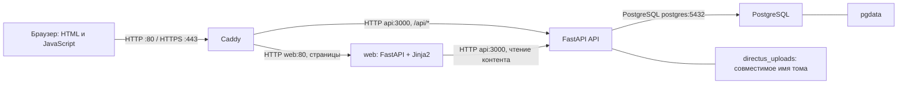

# Клуб выпускников факультета права НИУ ВШЭ

**Сообщество выпускников · Мероприятия · Личный кабинет**

[](https://github.com/Bogolubov-creator/hse-law-alumni-club/actions/workflows/ci.yml?query=branch%3Amain+event%3Apush)

Сайт объединяет новости и мероприятия Клуба, каталог ДПО и мерча, личный кабинет
выпускника и панель учебного офиса. Заявки сохраняются на сервере; онлайн-оплата
включается отдельно при настройке ЮKassa.

**Стек:** Python/FastAPI, Jinja2 и PostgreSQL. Страницы сайта, кабинет и панель
офиса формируются на сервере. React и TypeScript удалены; Node.js, npm и pnpm
для установки, сборки и запуска не нужны. JavaScript обслуживает браузерные
действия, плеер, PWA и Telegram. Отдельная CMS-подписка не требуется.

**Посмотреть сайт:** [демонстрационное зеркало](https://bogolubov-creator.github.io/club-pravo-hse-mirror/).
Оно собрано из тех же шаблонов и показывает синтетические данные. Отправка заявок,
регистрация, оплата и сохранение серверных правок в зеркале отключены.
Работающее приложение проверено локально на Ubuntu; публичный API-сервер
пока не развёрнут. Версии и результаты – в [журнале состояния](docs/operations/project-state.md).

Бейдж `Security & CI` показывает результат проверок ветки `main`;
состав проверок и пороги – в [разделе «Безопасность»](#безопасность).

> [!TIP]
> **Установка в двух словах:** получить код в `/opt/club` → `sudo ./scripts/install.sh` →
> выбрать локальный стенд или домен с HTTPS → открыть адрес из вывода и войти
> с первичным паролем администратора из защищённого файла. Подробно – в разделе
> [Установка на Ubuntu](#установка-на-ubuntu).

## Оглавление

1. [Быстрый старт](#быстрый-старт)
    - [Проверенная версия](#проверенная-версия)
2. [Что делает Клуб](#что-делает-клуб)
3. [Пользователи, роли и права](#пользователи-роли-и-права)
4. [Основные разделы и сценарии](#основные-разделы-и-сценарии)
5. [Технологии и назначение компонентов](#технологии-и-назначение-компонентов)
6. [Как всё работает](#как-всё-работает)
7. [Структура репозитория](#структура-репозитория)
8. [Требования к серверу](#требования-к-серверу)
9. [Сеть, домены и порты](#сеть-домены-и-порты)
10. [Конфигурация и секреты](#конфигурация-и-секреты)
11. [Локальный запуск](#локальный-запуск)
    - [Посмотреть зеркало локально](#посмотреть-зеркало-локально)
12. [Установка на Ubuntu](#установка-на-ubuntu)
    - [Простая установка](#простая-установка)
    - [Вариант А: ключ развёртывания](#вариант-а-ключ-развёртывания)
    - [Вариант Б: HTTPS](#вариант-б-https)
    - [Вариант В: архив Git](#вариант-в-архив-git)
    - [Подготовка Ubuntu и первый deploy](#подготовка-ubuntu-и-первый-deploy)
    - [Что делает deploy.sh](#что-делает-deploysh)
13. [Первый запуск и администратор](#первый-запуск-и-администратор)
14. [Забытый пароль](#забытый-пароль)
15. [HTTPS и сертификаты](#https-и-сертификаты)
16. [Данные и постоянные хранилища](#данные-и-постоянные-хранилища)
17. [Внешние интеграции](#внешние-интеграции)
18. [Фоновые задачи](#фоновые-задачи)
19. [Обновление и миграции](#обновление-и-миграции)
20. [Резервное копирование](#резервное-копирование)
21. [Восстановление и откат](#восстановление-и-откат)
22. [Мониторинг и журналы](#мониторинг-и-журналы)
23. [Безопасность](#безопасность)
24. [Разработка и тестирование](#разработка-и-тестирование)
25. [GitHub, CI и выпуск версий](#github-ci-и-выпуск-версий)
26. [Если что-то пошло не так](#если-что-то-пошло-не-так)
27. [Известные ограничения](#известные-ограничения)

## Быстрый старт

На компьютере разработчика нужны Git, Python 3.14 и uv.
Команды ниже устанавливают зависимости API, команд оператора и интерфейса,
собирают интерфейс и запускают его модульные тесты. Выполняйте их обычным
пользователем в новом каталоге. Запуск API описан в [локальном запуске](#локальный-запуск),
проверки с PostgreSQL – в [testing.md](docs/development/testing.md).

```bash
git clone https://github.com/Bogolubov-creator/hse-law-alumni-club.git club
cd club
uv sync --directory backend --frozen
uv sync --directory scripts --frozen
uv sync --directory frontend --frozen
uv run --directory frontend playwright install chromium
uv run --directory frontend python -m club_web.build --output /tmp/club-web
uv run --directory frontend python ../scripts/checks/check-web-build.py /tmp/club-web
uv run --directory frontend pytest -q
```

Команды используют основную ветку `main`. Проверенные ревизии, результаты CI
и сведения о локальном стенде – в [журнале состояния](docs/operations/project-state.md).
Ожидаемый результат – код завершения `0` у каждой команды. Тесты, требующие
PostgreSQL, запускаются отдельно. Для работающего сайта продолжите по
[локальному запуску](#локальный-запуск), для серверной репетиции – по
[инструкции Ubuntu](docs/operations/deploy-runbook.md). Рабочие секреты в репозиторий не входят.

### Проверенная версия

Перенос сайта, кабинета и офиса завершён в [PR 69](https://github.com/Bogolubov-creator/hse-law-alumni-club/pull/69).
Версия кода `2f19ee5` от 1 октября 2026 года прошла
[все четыре задания CI](https://github.com/Bogolubov-creator/hse-law-alumni-club/actions/runs/36852313065)
и установлена на локальном Ubuntu-стенде.

| Проверка | Результат этой версии |
|---|---|
| Шаблоны и браузерные сценарии | 106 тестов прошли; live-сценарии запускались отдельно |
| API и операции с PostgreSQL | 92 теста прошли |
| Собственный код | Проверены 226 файлов: комментариев и docstring нет; обязательные лицензии и shebang сохранены |
| Ubuntu после обновления | Через доверенный TLS проверены 22 раздела сайта, 16 разделов офиса и права четырёх ролей |
| Публикация зеркала | 165 страниц из тех же Jinja2-шаблонов; версия источника указана в `version.json` |

Это результаты указанной ревизии. Проверки следующих изменений доступны в CI
по бейджу выше; команды и условия публичного запуска – в
[журнале состояния](docs/operations/project-state.md).

## Что делает Клуб

- Публикует новости, мероприятия, программы ДПО, товары и подкасты.
- Принимает регистрацию, подтверждение почты и заявки на верификацию выпускников.
- Хранит профиль, заявки, баллы, достижения и связи с другими выпускниками.
- Позволяет офису обрабатывать заявки, редактировать контент и вести участников.
- Поддерживает Telegram Mini App и PWA; внешние каналы включаются конфигурацией.

В корзине оформляется заявка. Цену, скидку и доступность позиции перед сохранением
проверяет API. Скидка выпускника применяется к ДПО, а не ко всему содержимому корзины.

## Пользователи, роли и права

| Пользователь | Доступ |
|---|---|
| Гость | Публичные разделы, корзина, регистрация и восстановление доступа |
| Выпускник | Свой профиль, заявки, баллы, события и доступные материалы; верификация влияет на функции сообщества и привилегии |
| `editor` | Контент, обзор, чтение участников и заявок, обработка статусов заявок через панель офиса |
| `admin` / `Administrator` | Панель офиса, операции с баллами и скидками, верификация, чувствительные выгрузки, поддержка и административные действия |
| `club_api` | SQL-роль API для данных, auth и файлов; без создания ролей и доступа к архиву CMS-настроек |
| Оператор сервера | Миграции, bootstrap и управление сотрудниками через закрытые команды |

Полномочия сотрудника проверяются по текущему status и роли в PostgreSQL. Детали – в
[архитектуре](docs/development/architecture.md#роли-и-границы-доверия). Статус `verified` выпускника
не даёт административных прав. Имена ролей важны для серверных проверок.

## Основные разделы и сценарии

| Раздел | Маршруты | Сценарий |
|---|---|---|
| Публичный сайт | `/`, `/news`, `/news/:slug` | Просмотр главной и публикаций |
| Образование и мерч | `/dpo`, `/dpo/:slug`, `/merch`, `/merch/:slug`, `/cart` | Каталог, корзина, создание заявки, просмотр её статуса |
| Мероприятия | `/events`, `/events/:eventId` | Анонс, регистрация участника и календарь |
| Материалы | `/podcasts`, `/podcasts/:id`, `/changes`, `/saved` | Подкасты, дайджест и сохранённые материалы |
| Доступ | `/join`, `/confirm`, `/forgot`, `/reset` | Регистрация, подтверждение адреса, вход и сброс пароля |
| Кабинет | `/lk`, `/lk/profile` | Профиль, заявки, баллы, достижения и сообщество |
| Офис | `/admin/*` | Работа с участниками, заявками, контентом и медиа |
| Поддержка и сведения | `/support`, `/support/consent`, `/privacy`, `/confidential`, `/requisites` | Поддержка при включении и сведения об операторе |
| Мобильный вход | `/tg`, главная в Mini App/PWA | Мобильная оболочка тех же серверных функций |

Источник маршрутов – [pages.py](frontend/club_web/pages.py). Префиксы `/v2` и `/legacy`
обрабатываются переходами к каноническим адресам. Проверки сценариев перечислены в
[журнале состояния](docs/operations/project-state.md).

## Технологии и назначение компонентов

Версии закреплены в `backend/uv.lock`, `frontend/uv.lock`, `scripts/uv.lock`
и Docker-файлах. Решение о переносе сервера – в [ADR FastAPI](docs/decisions/fastapi-migration.md).

| Компонент | Версия | Назначение |
|---|---|---|
| Python / uv | 3.14.7 / 0.12.21 в сборке и CI | Сайт, API, команды оператора и экспорт зеркала; зависимости закреплены в uv.lock |
| FastAPI / Uvicorn / Pydantic | 0.142.2 / 0.54.0 / 2.13.5 | Web и HTTP API, ASGI-сервер и проверка запросов |
| Jinja2 | 3.1.6 | Серверные HTML-шаблоны сайта, кабинета и офиса |
| Psycopg / Argon2 / PyJWT | 3.3.6 / 25.1.0 / 2.15.1 | SQL-транзакции, прежние PHC-хеши и JWT-сессии |
| Pillow / python-multipart | 12.3.0 / 0.0.32 | Приём медиа и аватары 256×256 |
| HTTPX / Beautiful Soup | 0.28.1 / 4.15.0 | Проверяемые внешние запросы и разбор HTML |
| aiosmtplib / pywebpush | 5.1.3 / 2.5.0 | SMTP и Web Push |
| Sentry SDK | 2.71.0 | Только коды ошибок без запросов и персональных данных |
| pytest / Ruff | 9.1.1 / 0.16.9 | Проверки Python и PostgreSQL |
| PostgreSQL | 16.15 | Постоянные данные и транзакции |
| Caddy | 2.11.4 | HTTPS, прокси и выдача статических файлов |
| Playwright | 1.63.0 | Браузерные проверки на компьютере и ширине телефона; в рабочий образ не входит |
| Docker Compose / Ubuntu | Проверяемые версии стенда – в журнале | Контейнеры и серверная ОС |
| systemd / Bash / Python | Пакеты Ubuntu 24.04 | Таймеры, операции выпуска, проверки конфигурации и копий |
| Git / GitHub Actions | [ci.yml](.github/workflows/ci.yml) | История версий и автоматические проверки коммитов и PR |

Сроки поддержки и совместимость – в [архитектуре](docs/development/architecture.md#версии-и-совместимость).
В браузере используются обычные JavaScript-модули и CSS. Node.js и сборщик
интерфейса для разработки и развёртывания не требуются.
Caddy собирается с актуальными CEL и automemlimit; официальные backport-правки
и проверки описаны в [ADR сборки](docs/decisions/caddy-dependencies.md). Отказ от Directus
согласован в [ADR выбора CMS](docs/decisions/cms-options.md); данные обслуживаются через SQL.

## Как всё работает



Полная [схема Ubuntu](docs/development/architecture.md) показывает сборку, файловое хранилище,
интеграции, фоновые задачи, сертификаты, резервные копии и изменение эксплуатации.
PostgreSQL остаётся контейнером. Внутри Docker сервисы обращаются друг к другу по
именам; `127.0.0.1` означает текущий контейнер.

## Структура репозитория

```text
backend/
  club_api/modules/        маршруты и логика по предметным областям
  club_api/db/             SQL-адаптер, схемы данных и транзакции
  club_api/core/           проверка конфигурации приложения
  club_api/jobs/           расписание и хранение данных
  club_api/observability/  аудит, журналы и проверки готовности
  migrations/             SQL-миграции приложения
  sql/                    индексы и права роли API
  tests/python/           pytest, SQL-проверки и фикстуры
  pyproject.toml          зависимости и настройки Python-пакета
  uv.lock                 закреплённые версии зависимостей
frontend/
  club_web/               FastAPI web, клиент API и подготовка страниц
    templates/            Jinja2: сайт, кабинет и разделы офиса
    browser/              JavaScript-модули браузерных действий
    styles/               CSS и токены дизайна
  public/                 изображения, шрифты, иконки и manifest
  fixtures/               публичные данные статического зеркала
  tests/python/           шаблоны, браузерные сценарии и live-проверки
  pyproject.toml          зависимости и настройки Python-пакета
  uv.lock                 закреплённые версии зависимостей
data/                     единые справочники, FAQ, каталог и архив дайджеста
scripts/                  команды установки, выпуска, копирования и восстановления
  club_ops/               bootstrap, управление сотрудниками и импорты
  lib/                    общие shell/Python-функции операций
  checks/                 проверка сборок и финальных образов
  diagnostics/            диагностика, ресурсы и нагрузка
  tests/                  тесты операций, SQL и live-стек
  pyproject.toml          зависимости команд оператора
  uv.lock                 закреплённые версии зависимостей
deploy/                   Docker-файлы, Caddy, Compose override и systemd
.github/workflows/        CI
docs/                     development, operations, product, integrations, decisions
docker-compose.yml        сервисы и постоянные хранилища приложения
```

[AGENTS.md](AGENTS.md) задаёт правила изменений, [DESIGN.md](DESIGN.md) – решения
интерфейса. [docs/development/context.md](docs/development/context.md) служит коротким указателем для нового участника.
Справочники и инструкции собраны в [навигации документации](docs/README.md).
Правила размещения файлов и карта модулей – в [структуре проекта](docs/development/repository-structure.md).

## Требования к серверу

| Контур | Известная конфигурация | Основание |
|---|---|---|
| Разработка | Python 3.14, uv, Docker для интеграционных проверок | Версии проекта |
| Локальная Ubuntu-репетиция | Ubuntu 24.04 ARM64, 4 vCPU, 6 GiB RAM, диск 20 GiB | Исходный стенд; не оценка предельной нагрузки |
| Рабочий сервер | Подбирается по объёму данных и нагрузке | [Расчёт ёмкости](docs/operations/capacity.md) |

Размер диска включает ОС, данные, журналы, копии, старые и новые образы, кэш сборки
и свободное место для обновления. Минимум запуска и запас под аудиторию различаются.
Методика измерений, ограничения amd64/arm64 и роль swap – в [capacity.md](docs/operations/capacity.md).

## Сеть, домены и порты

| Порт хоста | Назначение | Доступ |
|---|---|---|
| `22/tcp` | SSH оператора | Только разрешённые адреса оператора |
| `80/tcp`, `443/tcp` | Caddy: сайт и прежний домен администрирования | В рабочем контуре – пользователи; в QA публикация ограничивается override |
| `127.0.0.1:8081` | Перенаправление в `/admin` через Caddy | Только локальный оператор |
| `3000`, `5432` | API и PostgreSQL | Только Docker-сеть; на хосте не публикуются |

`WEB_DOMAIN` и `PUBLIC_URL` задают сайт; `ADMIN_DOMAIN` сохраняет прежние ссылки
на файлы и перенаправляет вход в `/admin`. Порта CMS больше нет. Полная таблица сервисов и проверок – в
[архитектуре](docs/development/architecture.md#сервисы-и-хранилища).

## Конфигурация и секреты

Рабочий файл хранится в `/etc/club/runtime.env`, принадлежит `root` и имеет права
`0600`. Шаблон [.env.example](.env.example) не содержит пригодной рабочей конфигурации.
В локальной разработке также используйте отдельный файл вне репозитория.

Основные настройки:

| Переменная | Назначение | Обязательность | Секрет | Пример | Применение |
|---|---|---|---|---|---|
| `APP_ENV` / `SEED_DEMO` | Рабочий режим без демоданных | Для выпуска | Нет | `production` / `false` | Запуск |
| `PUBLIC_URL` / `WEB_DOMAIN` | Адрес сайта и имя для Caddy | Да | Нет | `https://club.example.com` / `club.example.com` | Запуск API и Caddy |
| `ADMIN_DOMAIN` | Прежний адрес файлов и переход в офис | Да | Нет | `office.example.com` | Запуск Caddy |
| `POSTGRES_PASSWORD` | Пароль владельца БД | Да | Да | Отдельное случайное значение | PostgreSQL, миграции, bootstrap |
| `CHECKOUT_DB_PASSWORD` | Пароль ограниченной SQL-роли API | Да | Да | Другое случайное значение | Запуск API |
| `AUTH_SECRET` / `ADMIN_AUTH_SECRET` | Раздельные ключи сессий | Да | Да | Независимые случайные значения | Запуск API |
| `ADMIN_EMAIL` / `ADMIN_PASSWORD` | Начальный администратор | Для bootstrap | Пароль | `admin@example.com` / отдельный пароль | Первый bootstrap |
| `SMTP_HOST` / `SMTP_FROM` | Почта и разрешённый отправитель | Для production | Нет; `SMTP_PASS` секретен | `mailpit` / `club@example.com` только в QA | Запуск API |
| `BACKUP_ENCRYPTION_KEY` | Шифрование копий | Для операций | Да | Отдельные 64 hex-символа | Backup и restore |
| `API_INTERNAL_URL` | Внутренний адрес API для web | Задан в Compose | Нет | `http://api:3000` | Запуск web |

Полная таблица с ограничениями и необязательными интеграциями находится в
[справочнике переменных](docs/development/configuration.md). Настройки прежней сборки
`VITE_*` больше не используются. Адреса применяются при запуске сервисов;
после изменения конфигурации выполните deploy. Примеры с `example.com` и Mailpit
предназначены для тестового контура.

## Локальный запуск

Для сайта нужен весь стек: PostgreSQL, миграции, bootstrap, API, `web` и
Caddy. Запуск одного web-сервиса не проверяет сохранение данных или работу интеграций.

Порядок подготовки изолированного контура – в [runbook](docs/operations/deploy-runbook.md).
Для разработки допускается `APP_ENV=development`; синтетические демо-аккаунты
создаются только при `SEED_DEMO=true`. Для безопасной репетиции внешние интеграции
оставляют выключенными, SMTP направляют в локальный Mailpit, фоновые импорты
отключают. Существующий сценарий виртуальной машины описан в
[ubuntu-vm-rehearsal.md](docs/operations/ubuntu-vm-rehearsal.md); актуальная проверенная версия
всегда указана в [журнале состояния](docs/operations/project-state.md).

### Посмотреть зеркало локально

После клонирования можно открыть интерфейс с синтетическими данными без БД:

```bash
uv sync --directory frontend --frozen
uv run --directory frontend python -m club_web.mirror --output /tmp/club-mirror --base /
uv run --directory frontend python -m http.server 4173 --bind 127.0.0.1 --directory /tmp/club-mirror
```

Откройте `http://127.0.0.1:4173/`. Поиск, фильтры, локальная корзина и просмотр
разделов работают в браузере. Отправка заявок и серверные изменения отключены.
Для проверки входа, прав и сохранения данных нужен полный стек.
Публикация на GitHub Pages и базовый путь описаны в
[инструкции зеркала](docs/integrations/pages-mirror.md).

## Установка на Ubuntu

Код размещается в новом `/opt/club`, секреты – в `/etc/club/runtime.env`.
Выберите способ получения кода, затем запустите установщик.
На сервере нужны Ubuntu 24.04, доступ по SSH, `sudo` и интернет к APT-источникам,
Docker Hub и PyPI. Python-зависимости устанавливаются внутри образов.

### Простая установка

На новой Ubuntu после получения проверенной версии кода:

```bash
cd /opt/club
sudo ./scripts/install.sh
```

По умолчанию мастер предлагает **локальную репетицию**. Публичный вариант
запросит домены сайта и прежних файлов, email администратора, отдельный адрес
для ACME, SMTP и получателя заявок. Для сертификатов оба домена должны указывать
на сервер, а входящие порты `80` и `443` быть доступны.

Установщик ставит системные зависимости и Docker, создаёт независимые случайные
секреты и начального администратора, собирает приложение с версиями из lockfile,
применяет миграции и проверяет сайт и `/api/ready`. Python и библиотеки
приложения устанавливаются внутри Docker. Рабочий env и данные входа хранятся
в `/etc/club`, с правами `0600`; пароль не попадает в вывод установщика.

После успешного запуска получите первичные данные входа **на сервере**:

```bash
sudo cat /etc/club/initial-admin.txt
```

Откройте выведенный адрес с `/admin`. Это первичный пароль без автоматического
истечения срока. Его смена – по [инструкции оператора](docs/operations/deploy-runbook.md#сотрудники-и-восстановление-доступа).
Повторный `install.sh` сохраняет env, ключи и пароль, затем выполняет deploy.
Существующую конфигурацию, подготовленную вручную, он не перезаписывает; для неё
используйте [ручной порядок](#подготовка-ubuntu-и-первый-deploy).

Локальный вариант можно выбрать без вопросов:

```bash
sudo ./scripts/install.sh --local
```

Он запускает `https://localhost:9443` и приёмник писем `http://localhost:8025`.
Оба порта доступны только с сервера; API и PostgreSQL не публикуются. Демо-код,
тестовые участники, внешняя почта и фоновые импорты выключены. HTTPS проверяется
с корнем Caddy `/etc/club/local-ca.crt`; браузеру нужно явно добавить доверие этой
локальной CA. Установщик не меняет доверие ОС. Для доступа с рабочего компьютера:

```bash
ssh -L 9443:127.0.0.1:9443 -L 8025:127.0.0.1:8025 USER@SERVER
```

В другом терминале получите **публичный сертификат CA**, добавьте его в доверенные
сертификаты браузера или ОС и откройте `https://localhost:9443/admin`:

```bash
ssh USER@SERVER 'sudo cat /etc/club/local-ca.crt' > club-local-ca.crt
```

Перенос существующих данных и обновление версии описаны в
[runbook](docs/operations/deploy-runbook.md). Установщик прекращает новую установку,
если у выбранного Compose-проекта уже есть контейнеры или тома. Для отдельного
каталога конфигурации есть `--config-dir /etc/club-other`; он не меняет имя проекта
или порты и не предназначен для второго одновременного стенда.

| Способ | Когда подходит | Получение обновлений |
|---|---|---|
| А: ключ развёртывания | Закрытый репозиторий и постоянный доступ сервера к GitHub | `git fetch` по ключу только для чтения |
| Б: HTTPS | Публичный репозиторий либо доступ по токену | `git fetch`; закрытый репозиторий требует авторизации |
| В: архив Git | У сервера нет доступа к GitHub | Новый `.bundle` с проверенным SHA |

Во всех вариантах выбирается полный `REVIEWED_COMMIT`, проверенный в CI и
согласованный для установки. Текущие PR и проверенные SHA – в
[журнале состояния](docs/operations/project-state.md). Существующий `/opt/club` обновляют
по [runbook](docs/operations/deploy-runbook.md).

### Вариант А: ключ развёртывания

На новом сервере установите Git и создайте отдельный ключ вне репозитория:

```bash
sudo apt-get update
sudo apt-get install -y --no-install-recommends git ca-certificates openssh-client
sudo install -d -m 0700 /root/.ssh
sudo ssh-keygen -t ed25519 -f /root/.ssh/club_deploy -N "" -C "club-server"
sudo cat /root/.ssh/club_deploy.pub
```

Добавьте **публичный** ключ в GitHub: Settings → Deploy keys → Add deploy key.
Разрешение записи не включайте. При первом SSH-подключении сверяйте ключ хоста
по [отпечаткам GitHub](https://docs.github.com/en/authentication/keeping-your-account-and-data-secure/githubs-ssh-key-fingerprints).
Закрытый ключ остаётся на сервере.

```bash
sudo env GIT_SSH_COMMAND='ssh -i /root/.ssh/club_deploy -o IdentitiesOnly=yes' \
  git clone git@github.com:Bogolubov-creator/hse-law-alumni-club.git /opt/club
sudo git -C /opt/club config core.sshCommand 'ssh -i /root/.ssh/club_deploy -o IdentitiesOnly=yes'
sudo git -C /opt/club checkout --detach REVIEWED_COMMIT
```

Результат – checkout выбранного SHA; `core.sshCommand` сохраняет выбор ключа для
следующего `git fetch`. Затем переходите к [подготовке Ubuntu](#подготовка-ubuntu-и-первый-deploy).

### Вариант Б: HTTPS

После установки Git и `ca-certificates` выполните:

```bash
sudo git clone https://github.com/Bogolubov-creator/hse-law-alumni-club.git /opt/club
sudo git -C /opt/club checkout --detach REVIEWED_COMMIT
```

Публичный репозиторий клонируется без пароля. Для закрытого репозитория Git запросит
логин и токен GitHub с доступом Contents: Read-only к этому репозиторию. Токен
вводится в запрос пароля, не в URL или команду. Затем выполняется общая подготовка.

### Вариант В: архив Git

Скрипты выпуска требуют историю и SHA Git, поэтому ZIP без `.git` не подходит.
Используйте `.bundle`: он переносит проверенный коммит и его историю без рабочих
файлов `.env`, незакоммиченных изменений и ключей.

На компьютере разработчика в клоне Клуба, где есть согласованный полный SHA:

```bash
git bundle create ../club-source.bundle HEAD
git bundle verify ../club-source.bundle
scp ../club-source.bundle USER@SERVER:/tmp/club-source.bundle
```

Перед созданием bundle `HEAD` должен совпадать с `REVIEWED_COMMIT`;
проверьте это командой `git rev-parse HEAD`. На новом сервере с установленным Git:

```bash
sudo git init /opt/club
sudo git -C /opt/club fetch /tmp/club-source.bundle HEAD
sudo git -C /opt/club checkout --detach FETCH_HEAD
sudo git -C /opt/club rev-parse HEAD
```

Полученный SHA должен совпасть с согласованным. После этого выполните общую
подготовку. Для обновления передайте новый bundle и получите выбранный SHA через
`git fetch /tmp/club-source.bundle HEAD`, сохранив порядок backup/deploy из runbook.
Этот вариант исключает доступ к GitHub; для установки пакетов и сборки образы и
реестры зависимостей всё равно должны быть доступны.

### Подготовка Ubuntu и первый deploy

Выполняется оператором через `sudo` из `/opt/club` после выбора SHA:

```bash
cd /opt/club
sudo bash scripts/setup-ubuntu.sh
sudo install -d -m 0700 /etc/club
sudo test ! -e /etc/club/runtime.env
sudo cp --no-clobber .env.example /etc/club/runtime.env
sudo chmod 0600 /etc/club/runtime.env
sudoedit /etc/club/runtime.env
```

Заполните production-настройки по [справочнику переменных](docs/development/configuration.md),
включая SMTP, получателя и канал уведомлений офиса.
Для локальной репетиции используйте Mailpit, отключённые внешние интеграции и
одинаковый QA override во всех командах по
[инструкции стенда](docs/operations/ubuntu-vm-rehearsal.md#изолированная-конфигурация).
Затем в рабочем контуре:

```bash
sudo env ENV_FILE=/etc/club/runtime.env bash scripts/preflight.sh
sudo env ENV_FILE=/etc/club/runtime.env bash scripts/deploy.sh
```

Ожидаются код `0`, healthy у постоянных сервисов, HTTPS `/api/ready` и главная
страница с ответом `200`. Скрипт проверяет их через Caddy; после него проверьте вход,
заявку и роли офиса. Адрес и конфигурация должны соответствовать выбранному контуру.
Подробный порядок и диагностика – в [runbook](docs/operations/deploy-runbook.md#подготовка-и-первый-запуск).

### Что делает deploy.sh

Установка и обновление используют один [scripts/deploy.sh](scripts/deploy.sh):

| Шаг | Действие |
|---|---|
| 1 | Общая блокировка и preflight: ОС, инструменты, чистый checkout, env, место и порты |
| 2 | Сборка образов выбранного SHA и проверка production-конфигурации API |
| 3 | На существующей установке – согласованный снимок БД и uploads с остановкой записи |
| 4 | Запуск PostgreSQL, SQL-миграции, индексы и ограничения роли API |
| 5 | Bootstrap только отсутствующих ролей, администратора и начальных записей |
| 6 | Запуск API/web/Caddy, перечитывание прокси и проверка HTTPS сайта и `/api/ready` |
| 7 | Запись успешной версии в `/var/lib/club-ops/last-deploy.json` |

При ошибке команда завершается с ненулевым кодом. Автоматического отката БД нет;
порядок восстановления описан [ниже](#восстановление-и-откат). Systemd-таймеры
устанавливаются отдельно по [runbook](docs/operations/deploy-runbook.md#таймеры-и-мониторинг).

## Первый запуск и администратор

`migrate` создаёт и дополняет схему PostgreSQL, применяет индексы и права SQL-роли.
Затем [bootstrap.py](scripts/club_ops/bootstrap.py) создаёт отсутствующие
роли, администратора из `ADMIN_EMAIL`/`ADMIN_PASSWORD`, справочники и главную страницу.
API стартует только после успешного завершения обоих шагов.

Повторный bootstrap сохраняет UUID, пароль, роль, настройки и редакторские изменения.
Изменение `ADMIN_PASSWORD` не сбрасывает существующий пароль. Создание сотрудника и
восстановление его пароля выполняет оператор через
[staff.py](scripts/club_ops/staff.py), с подключением владельца БД и паролем
через stdin. Публичное восстановление предназначено только для alumni. Команды и
проверка повторного запуска – в [runbook](docs/operations/deploy-runbook.md).

## Забытый пароль

| Учётная запись | Как восстановить доступ |
|---|---|
| Выпускник | `/forgot`: письмо через настроенный SMTP, затем одноразовая ссылка `/reset` |
| `admin` / `editor` | Оператор запускает `manage-staff` для существующей роли сотрудника |

Для локального активного администратора без MFA оператор из `/opt/club`
подготавливает закрытый файл с новым паролем длиной 12–100 символов.
Замените `admin@example.com` существующим адресом сотрудника:

```bash
sudo install -m 0600 /dev/null /etc/club/staff-password
sudoedit /etc/club/staff-password
sudo sh -c 'docker compose --env-file /etc/club/runtime.env -f /opt/club/docker-compose.yml \
  run --rm --no-deps -T -e STAFF_ACTION=reset-password -e STAFF_ROLE=admin \
  -e STAFF_EMAIL=admin@example.com bootstrap python -m club_ops.cli manage-staff \
  < /etc/club/staff-password'
sudo rm /etc/club/staff-password
```

Для редактора укажите `STAFF_ROLE=editor`; в QA добавьте тот же Compose override.
Пароль передаётся через stdin. Ожидается `Аккаунт сотрудника: password-reset`;
после сброса проверьте новый вход и отказ старой сессии. Операция не меняет роль,
статус, MFA или внешнего провайдера. Изменение `ADMIN_PASSWORD` в env не сбрасывает
существующий пароль. Подробности – в [runbook](docs/operations/deploy-runbook.md#сотрудники-и-восстановление-доступа).

## HTTPS и сертификаты

В локальном HTTP-контуре используются `WEB_DOMAIN=:80` и `ADMIN_DOMAIN=:8081`.
В рабочем контуре Caddy получает сертификаты для доменных имён и продлевает их;
данные ACME и ключи остаются в томе `caddy_data`.

Для локального HTTPS нужен доверенный тестовый CA. `HTTPS_CA_FILE` передаёт его
операционным проверкам. `curl -k` не подтверждает корректность TLS. В API-сессиях
используется Bearer JWT. HTTPS, редиректы, CSP и доверенные прокси проверяются
отдельно по [runbook](docs/operations/deploy-runbook.md).

## Данные и постоянные хранилища

| Хранилище | Содержимое |
|---|---|
| `pgdata` | PostgreSQL: участники, заявки, контент, баллы, события и служебные таблицы |
| `directus_uploads` | Файлы API; прежнее имя тома сохранено для совместимости |
| `caddy_data` | Сертификаты, закрытые ключи и данные ACME |
| `caddy_config` | Состояние конфигурации Caddy |
| `/etc/club/runtime.env` | Рабочая конфигурация и секреты |
| `/var/backups/club` | Зашифрованные наборы резервного копирования |

Имена `directus_users`, `directus_roles`, `directus_files` и `directus_uploads`
сохранены для совместимости UUID, связей и загрузок; сервер CMS не запускается.
Полные старые настройки хранятся приватно в `club_settings`, вне доступа API.

Compose добавляет к именам томов имя проекта. Пересборка контейнера не должна
удалять тома. Команды удаления томов не входят в обычное обновление. Порядок хранения
ключей отдельно от копий и восстановления – в [runbook](docs/operations/deploy-runbook.md).

## Внешние интеграции

| Интеграция | Включение и граница проверки |
|---|---|
| SMTP | Обязателен в `APP_ENV=production`; в QA письма перехватывает Mailpit |
| ЮKassa | Пара ключей магазина; без них заявки работают без онлайн-оплаты |
| Telegram | Токен бота, отдельный webhook secret либо локальный polling; офисные уведомления настраиваются отдельно |
| Web Push | Пара VAPID-ключей и разрешение пользователя |
| HSE ДПО / источники новостей | Серверные импорты, отдельные флаги включения; полученный материал требует редакционной проверки |
| Sentry | `SENTRY_DSN`; пустое значение отключает отправку |
| Offsite | Проверенное назначение rclone; пустое значение означает только локальное хранение |

Назначение переменных и адресов – в [configuration.md](docs/development/configuration.md).
Наличие реализации не подтверждает оплату, доставку письма или сообщения.

## Фоновые задачи

При одном экземпляре API планировщик `asyncio` обслуживает баллы, импорты, напоминания,
очистку по сроку хранения, истечение резервов и почтовую очередь. Расписания заданы
в часовом поясе `Europe/Moscow`; общий выключатель – `JOBS_ENABLED=false`.

Ежедневное обслуживание копий запускает один `systemd` timer в 03:30
`Europe/Moscow` с `Persistent=true`. Второй timer запускает мониторинг. Параллельный
старый cron для тех же операций не устанавливают. Полный перечень и поведение
после ошибки – в [архитектуре](docs/development/architecture.md#фоновые-задачи) и
[runbook](docs/operations/deploy-runbook.md).

## Обновление и миграции

Обновляется конкретный проверенный коммит. Скрипт проверяет конфигурацию и собирает
новую версию; перед изменением данных фиксируются исходная версия и резервная копия.
Затем выполняются миграции, bootstrap, запуск и проверка через Caddy. Ненулевой код
завершения требует диагностики.

SQL лежит в [backend/migrations](backend/migrations), индексы – в
[backend/sql/indexes.sql](backend/sql/indexes.sql). Совместимость миграций со старым кодом
оценивается в PR. Полный порядок – в [runbook](docs/operations/deploy-runbook.md).

## Резервное копирование

[scripts/backup.sh](scripts/backup.sh) готовит один согласованный набор:
PostgreSQL, uploads и сведения о версии. Используются блокировка,
промежуточное имя, контрольные суммы и ограниченные права. Для согласования БД и
файлов предусмотрено окно остановки записи; его учитывают при выборе расписания.

Локальная копия не защищает от потери сервера. Offsite и чтение из него проверяются
отдельно. Политика хранения, шифрование, права и команды – в
[runbook](docs/operations/deploy-runbook.md). Факт успешного восстановления указан только в
[журнале состояния](docs/operations/project-state.md).

## Восстановление и откат

[scripts/restore.sh](scripts/restore.sh) предназначен для изолированного проекта
Compose с новыми томами. Проверяются данные, файлы, вход и повторное чтение через
приложение. Восстановление рабочей БД поверх существующей не является безопасной
репетицией.

Откат кода и восстановление данных – разные операции. Запуск старого образа после
несовместимой миграции не откатывает схему. Решение и точные команды для конкретного
релиза описываются в PR и [runbook](docs/operations/deploy-runbook.md).

## Мониторинг и журналы

[scripts/monitor.sh](scripts/monitor.sh) и таймер обслуживания проверяют состояние
контура. API даёт `/api/health` для живого процесса и `/api/ready` для готовности
зависимостей. Docker ограничивает размер журналов каждого сервиса; результаты
системных задач доступны через `journalctl`.

Пороги диска, возраста копии и срока TLS, проверка OOM, периодичность и ответственный
описаны в [runbook](docs/operations/deploy-runbook.md). Пока канал оповещений не настроен и не
проверен, журналы и код завершения команды остаются локальными сигналами.

## Безопасность

Бейдж `Security & CI` связан с последним запуском workflow для `main` после push.
Зелёный статус появляется, когда все задания завершились успешно, включая:

| Проверка | Критерий успешного завершения |
|---|---|
| Секреты | Gitleaks завершился без срабатываний правил репозитория |
| Python-зависимости API, web и команд оператора | pip-audit: рабочие и разработческие зависимости проверяются отдельно |
| Go-зависимости Caddy | `govulncheck` не обнаружил достижимых известных уязвимостей |
| Пять рабочих образов | Trivy не обнаружил HIGH/CRITICAL в API, bootstrap, web, Caddy и PostgreSQL |
| Состав выпуска | В конечных образах нет собственных исходников, тестов, env, sourcemap и демо-кода |
| TLS и HTTP-периметр | Тесты сертификата, reload, CSP, proxy headers и лимитов прошли |
| Права доступа | Серверные, SQL- и браузерные тесты ролей прошли |

Ссылки на логи и проверенный SHA доступны по нажатию на бейдж.
Команды и границы автоматических проверок – в [документе о безопасности](docs/development/security.md)
и [описании тестов](docs/development/testing.md).

Цены, права и операции с данными проверяются сервером. Хеши паролей, секреты JWT,
пароли БД и ключи интеграций доступны только серверным компонентам. Вебхук ЮKassa
проверяет отправителя, затем статус и сумму через API провайдера.

API и PostgreSQL не имеют опубликованных портов. Caddy задаёт ограничения запросов
и заголовки; API применяет валидацию, лимиты и проверки доступа. Bearer-токены в
браузере требуют защиты от XSS. Аудит зависимостей, роли, секреты, восстановление и
проверки реального контура дополняют друг друга; результат любой одной проверки
не означает отсутствие всех рисков.

Границы и ограничения – в [архитектуре](docs/development/architecture.md), требования к
конфигурации – в [справочнике](docs/development/configuration.md). Технические механизмы работы
с персональными данными и проверки перед запуском описаны в
[документе о данных](docs/product/152fz-compliance.md); сведения об операторе подтверждает владелец.

## Разработка и тестирование

Команды выполняются обычным пользователем из корня клона с Python 3.14 и uv.
Docker Engine нужен для проверки Compose и интеграционного сценария.
Ожидаемый результат каждой команды – код `0`; сценарий PostgreSQL создаёт
отдельную тестовую БД.

```bash
uv sync --directory backend --frozen
uv sync --directory scripts --frozen
uv sync --directory frontend --frozen
uv run --directory frontend playwright install chromium
uv run --directory backend ruff check club_api tests/python ../scripts/club_ops
uv run --directory backend ruff format --check club_api tests/python ../scripts/club_ops
uv run --directory frontend ruff check club_web tests/python
uv run --directory frontend ruff format --check club_web tests/python
uv run --directory frontend python -m club_web.build --output /tmp/club-web
uv run --directory frontend python ../scripts/checks/check-web-build.py /tmp/club-web
uv run --directory frontend python ../scripts/checks/check-comments.py
uv run --directory backend pytest -q
uv run --directory frontend pytest -q
docker compose --env-file .env.example config --quiet
bash scripts/tests/test-integration.sh
```

Сайт, API и команды оператора используют Python. HTML создаётся из Jinja2-шаблонов.
Часть тестов подменяет внешних провайдеров; они не доказывают сохранение в БД.
PostgreSQL-интеграция использует настоящие миграции; браузерная цепочка запускается
с собранными API, web и БД. Playwright запускают только против указанного
тестового контура: некоторые сценарии изменяют данные. Команды и фактические прогоны – в
[журнале состояния](docs/operations/project-state.md) и [runbook](docs/operations/deploy-runbook.md).
Проверки сборки web и содержимого финальных контейнеров описаны в
[testing.md](docs/development/testing.md#безопасность-и-содержимое-образов).

## GitHub, CI и выпуск версий

Изменения готовятся в небольших ветках `codex/...` и PR. Основной workflow –
[Security & CI](.github/workflows/ci.yml); результаты всегда сверяются с SHA проверяемого коммита.
В workflow включены установка по lockfile, Ruff, проверка комментариев, сборка и модульные тесты,
аудит, PostgreSQL-интеграция и сборка контейнеров с настоящей браузерной цепочкой.
Наличие шага не подтверждает его успешный запуск: результат берётся из CI нужного SHA.
Защита `main` и обязательные проверки описаны в [журнале состояния](docs/operations/project-state.md).
Изменение workflow не меняет правила защиты ветки автоматически.

Описание выпуска должно содержать версию и SHA, изменения, миграции, новые
переменные, совместимость данных, команды обновления и отката, среду и результаты
проверок. История изменений сохраняется в Git и PR; подтверждение проверенного
состояния – в [журнале состояния](docs/operations/project-state.md). Слияние PR и публикация
требуют отдельного поручения владельца.

## Если что-то пошло не так

Команды диагностики выполняет оператор на Ubuntu из `/opt/club` с рабочим внешним
env. Полные варианты команд с `sudo` и override – в [runbook](docs/operations/deploy-runbook.md).

| Симптом | Проверка | Действие | Ожидаемый результат | Следующий шаг |
|---|---|---|---|---|
| Сайт недоступен | Порты, `compose ps`, журнал Caddy | Устранить конфликт порта или ошибку домена | Caddy принимает запрос с нужным Host | Проверить `/api/ready` |
| `502` или `503` | API, PostgreSQL, результаты `migrate` и `bootstrap` | Исправить упавшую зависимость или конфигурацию | Готовность API `200` | Пройти пользовательский сценарий |
| Вход не работает | Подтверждение адреса, статус пользователя, SMTP | Проверить письмо в тестовом приёмнике или доставку SMTP | Пользователь входит своей ролью | Проверить отказ чужой роли |
| Регистрация без письма | SMTP и почтовая очередь | Исправить отправителя/доступ к SMTP | Письмо доставлено и ссылка работает | Повторно проверить вход |
| TLS не доверен | Имя, цепочка, часы, срок сертификата | Подключить тестовый CA либо исправить DNS/ACME | HTTPS проходит без `-k` | Проверить HTTP-редирект |
| Копия устарела | Timer, journal, место, ключ, последняя успешная запись | Устранить причину и повторить копию | Новый завершённый набор с контрольными суммами | Изолированно восстановить |
| После обновления пустой каталог | Публикация контента, выбранная БД, отключённые демо-сиды | Проверить публикацию в панели контента и выбранную БД | API отдаёт ожидаемые публикации | Проверить страницу и права |
| Диск заканчивается | `df`, размеры данных/копий/образов/кэша | Удалить только подтверждённо ненужные артефакты | Достаточный запас на копию и обновление | Повторить preflight |

## Известные ограничения

- Публичное окружение, доставка реальной почты, платежи и внешние уведомления
  проверяются отдельно после согласования сервера и интеграций.
- В API допускается один экземпляр: блокировки фоновых задач и часть состояния
  процесса не рассчитаны на независимые реплики.
- Offsite и канал оповещений нельзя считать настроенными по наличию переменных.
- Совместимость нативного auth/files и обновлённых зависимостей подтверждается конкретными
  прогонами; сроки поддержки сверяются по [официальным источникам](docs/development/architecture.md#версии-и-совместимость).
- Размер локального стенда и успешный короткий тест не определяют предельную
  вместимость сайта. Нагрузочные допущения указаны в [capacity.md](docs/operations/capacity.md).
- Импортированный контент и исторические материалы не переписываются автоматически;
  авторство, условия использования и реквизиты проверяет владелец.

Точный список незавершённого и доказательства выполненного – в
[docs/operations/project-state.md](docs/operations/project-state.md).
