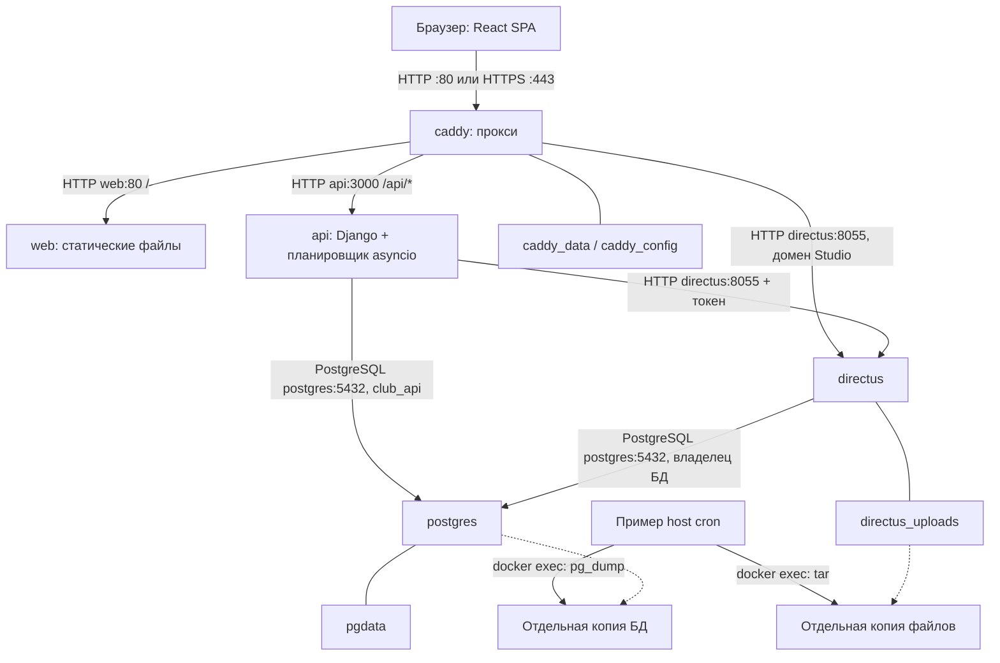
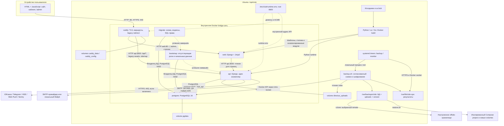

# Архитектура Клуба

Документ объясняет устройство приложения и эксплуатационного контура. Доказательства
проверок конкретной версии находятся в [project-state.md](../operations/project-state.md), команды –
в [deploy-runbook.md](../operations/deploy-runbook.md), настройки – в [configuration.md](configuration.md).

## Назначение и границы модулей

| Каталог | Ответственность | Чего здесь быть не должно |
|---|---|---|
| `frontend/club_web/templates` | Страницы, оболочки, формы и навигация | Серверных секретов и окончательного решения о цене/правах |
| `frontend/club_web/pages.py`, `client.py`, `browser` | Функции сайта, HTTP-клиенты, состояние и общие преобразования | Прямого доступа к SQL, хешей и серверных ключей |
| `backend/club_api/modules` | Маршруты, схемы запросов, права и логика предметных областей | Независимых копий правил расчёта |
| `backend/club_api/db`, `core`, `jobs`, `observability` | Данные, общие механизмы, расписание, аудит и настройки | Неявного доверия цене и роли из браузера |
| `data` | Общие справочники и архив дайджеста | Запросов с серверными ключами из общего браузерного кода |
| `backend/club_api/modules/auth` | Создание и проверка Argon2-хешей только на сервере | Импорта из клиентского приложения |
| `scripts/club_ops` | Нативный bootstrap, управление сотрудниками и импорты | Сброса контента или паролей пользователя при повторном запуске |
| `backend/migrations`, `backend/sql` | SQL-структура, ограничения, индексы и права роли API | Автоматического удаления рабочих данных ради запуска |
| `scripts/*.sh`, `deploy/systemd` | Установка, обновление, копии, восстановление, мониторинг | Второго несогласованного способа обслуживания |

Маршруты интерфейса выбираются в [pages.py](../../frontend/club_web/pages.py).
Полная карта каталогов и правило выбора модуля – в [структуре проекта](repository-structure.md).
Основные страницы используют `templates/base.html`; Telegram/PWA включают мобильную
оболочку. Общая логика API и расчётов для них одна. Рабочие инструкции собраны в
[навигации документации](../README.md); историю прототипов сохраняет Git.

## Исходная схема

Схема описывает базовый коммит `93fc86f` перед операционными изменениями. Host cron
на схеме – механизм прежнего примера конфигурации, а не утверждение, что он был
установлен на локальном стенде.

Раздельные копии не задавали общую точку состояния БД и файлов. Проверка SQL в
временной БД не подтверждала восстановление полного приложения с загрузками.

## История архитектуры

Прежняя схема с React и Directus сохранена в
[истории Git](https://github.com/Bogolubov-creator/hse-law-alumni-club/blob/a03b14174f31ee0821e14a70411979f6d780a844/docs/development/architecture.md).
Для текущего приложения действует схема ниже.

## Схема обслуживания после изменений

По [решению владельца](../decisions/cms-options.md) Directus исключён из runtime.
Django API обслуживает auth, контент и файлы; Django web и Jinja2 формируют сайт
и панель офиса. PostgreSQL хранит данные. Имена legacy
таблиц и тома сохранены для совместимости. Успешный запуск этой схемы в конкретном
контуре подтверждается отдельно в журнале состояния.

У offsite нет заранее установленного адреса: протокол, порт и права задаются
конкретным rclone remote. Пустой `BACKUP_OFFSITE_REMOTE` оставляет только локальные
копии. Mailpit используется тестовым override и не входит в рабочий Compose.

## Сервисы и хранилища

| Компонент | Технология | Размещение и адрес | Внешний доступ | Постоянные данные | Проверка готовности |
|---|---|---|---|---|---|
| Браузер | HTML, CSS и JavaScript | Устройство пользователя, HTTPS сайта | К Caddy | Локальное состояние; не основная БД | Сценарий и console |
| Сборка | Python, uv; Go для инфраструктуры | Docker build stages, реестры по HTTPS | Исходящий при сборке | Кэш и готовые образы | Код `0`, типы, тесты, скан образа |
| Прокси | Caddy | `caddy`; host `:80`, `:443`, loopback `:8081` | Сайт; прежний admin-домен перенаправляет в `/admin` | `caddy_data`, `caddy_config` | Внутренний `127.0.0.1:2019`, затем HTTPS |
| Страницы и статика | Django и Jinja2 | `web:80`, шаблоны и public | Через Caddy | Включены в образ | Внутренний HTTP `/` |
| API | Django | `api:3000`, один экземпляр | Через Caddy | БД и uploads | `/health` – процесс; `/ready` – PostgreSQL и схема |
| База | PostgreSQL 16 | `postgres:5432` | Порта хоста нет | `pgdata` | `pg_isready`, затем `/ready` API |
| Миграции | psql и shell | Одноразовый `migrate` | Нет входящего порта | Схема, индексы, права `club_api` | Завершение с кодом `0` |
| Bootstrap | Python и Psycopg | Одноразовый `bootstrap` | Нет входящего порта | Отсутствующие роли, администратор, справочники, home | Завершение с кодом `0` |
| Операции | Bash/Python, Docker CLI, systemd | Ubuntu host | Исходящий HTTPS, Docker socket | `/var/backups/club`, `/var/lib/club-ops` | Exit status, journal, успешная копия |

Порядок: `postgres healthy → migrate completed → bootstrap completed → API`.
`depends_on` задаёт старт, но не подтверждает пользовательский сценарий.
Лимиты Compose: PostgreSQL 1 GiB, API 512 MiB, web и Caddy по 128 MiB. Сборка,
кэш, ОС и копии требуют дополнительного запаса: [capacity.md](../operations/capacity.md).

## Данные и файловые потоки

| Домен | Хранилище и владелец записи | Инвариант |
|---|---|---|
| Контент, каталог, страницы | Бизнес-таблицы; внутренний [store.py](../../backend/club_api/db/store.py) | Разрешённые таблицы/поля, параметры SQL, серверный фильтр публикации |
| M2A | `pages`, `pages_blocks`, `block_hero`, `block_cta` | Раскрытие только известных типов блоков, порядок sort; не универсальный CMS query engine |
| Пользователи | `directus_users`, `directus_roles`; [service.py](../../backend/club_api/modules/auth/service.py) | Прежние UUID и PHC-хеши; актуальные status/роль; нет выдачи секретных полей |
| Пароли | Серверный пакет `club_api.modules.auth.passwords` | Argon2 создаёт новый хеш и проверяет параметры legacy PHC; браузер пакет не импортирует |
| Настройки | `club_settings` | `site` – публичный whitelist; `legacy_directus:<id>` – полный приватный архив. Runtime SQL-роль не читает всю таблицу |
| Файлы | `directus_files` + `directus_uploads`, путь API `/data/uploads` | Сохранение UUID и bytes, валидация загрузки, отсутствие общей открытой директории |
| Заявки и склад | `orders`, `club_checkout_*`, каталог; checkout-store | Цена пересчитывается сервером; резерв и запись атомарны |
| Оплата и подписка | orders/alumni; payment-store | Проверка провайдера, связанного ID, суммы и валюты; транзакция и идемпотентность |
| Баллы | `points_ledger`, achievements, alumni caches | Ledger является журналом начислений; кэш не заменяет его |
| Сессии | `club_auth_revocations`, `club_staff_sessions`, `alumni.token_version` | Постоянный отзыв/поколение токенов переживают рестарт |
| Поддержка и очереди | Собственные `club_*` таблицы | Права и сроки хранения определяет API |

`001_native_base.sql` создаёт чистую основу или дополняет старую схему. Остальные
SQL-миграции выполняются после неё. Базовая миграция не удаляет старые CMS-таблицы
и не заменяет существующие записи. Миграция аватаров добавляет
`club_upload_kind=avatar` в metadata текущих файлов, сохраняя UUID, байты и прочие
ключи metadata. Дубликаты `alumni.user_id` останавливают добавление unique;
их разбирают вручную. Повторный bootstrap сохраняет пароли, роли и ручные изменения.
Демо-каталог и тестовые аккаунты создаются только при `SEED_DEMO=true` вне production.
Описания в `dpo-mirror-catalog.generated.ts` отредактированы для сайта клуба.
Повторный `import-dpo` сохраняет описания, подписи, аудиторию, результаты и
преимущества существующих программ по `hse_id`; цена, дата и набор обновляются
из источника. `refresh-dpo-enrollment` сохраняет тексты и обновляет статус набора.

Медиараздел находится в панели офиса. Публичная выдача изображения требует ссылки
из опубликованного контента, аватар обслуживается отдельным маршрутом, аудио
подкаста – проверкой права и подписанной ссылкой. Старый путь `/assets/<uuid>`
проходит через API с теми же ограничениями; он не открывает каталог uploads.
Внешнее медиа не включается в локальную резервную копию автоматически.

Аватар декодируется до записи; публичный ответ формируется sharp 0.35.5 как PNG
256×256 с заполнением кадра, поворотом по EXIF и без исходных метаданных. Original
остаётся неизменным. Ограничения: 16 MP, три секунды обработки, два одновременных
преобразования и восемь ожидающих, ограниченный кэш 64 записи/16 MiB/пять минут.
Другие изображения и аудио офиса не преобразуются этим модулем.

## Роли и границы доверия

| Роль | API Клуба | SQL и обслуживание |
|---|---|---|
| Гость | Опубликованный контент, корзина и доступные формы | Нет прямого доступа к БД |
| Выпускник | Свой кабинет по JWT; часть действий зависит от верификации | Роль alumni не становится сотрудником |
| `editor` | Контент и файлы, обзор, список участников/заявок, смена статуса заявки | Чувствительные операции закрывает `requireFullAdmin` |
| `admin` / legacy `Administrator` | Баллы, скидки, выгрузки, верификация, поддержка и прочие операции офиса | Это роль приложения; не владелец PostgreSQL |
| `club_api` | SQL-подключение всех модулей API | Без superuser/создания БД/ролей/репликации; без UPDATE роли пользователя и чтения CMS-архива |
| Оператор Ubuntu | Миграции, bootstrap, manage-staff, копии | Root и Docker socket дают контроль над хостом и контейнерами |

Общий слой данных не читает password/token/TFA и не изменяет системные роли.
Нативный auth имеет отдельные узкие запросы хеша, provider/TFA и обновления пароля.
SQL-роль имеет доступ к данным всех участников: разграничение между пользователями
проверяет приложение, а не PostgreSQL row-level security.

`manage-staff.ts` работает от владельца БД и принимает пароль через stdin либо
окружение. Повторное создание не меняет существующий аккаунт; сброс увеличивает
версию служебной сессии. Он не повышает выпускника до сотрудника и не отключает MFA.
SSO/MFA-аккаунты сохраняются в БД; вход по одному локальному паролю для них закрыт
до отдельного решения о переносе способа входа.

Сессии передаются в `Authorization: Bearer`: alumni – 7 дней, офис – 12 часов.
Офис проверяет текущие status/роль и поколение сессии при каждом запросе. Сброс
пароля alumni увеличивает `token_version`; его обычный logout удаляет токен только
из браузера. Admin logout сохраняет отзыв `jti` в БД. Токены в браузерном хранилище
оставляют риск XSS: [security.md](security.md).

API и PostgreSQL не публикуют порты на host. Прямой порт API изменит доверие к
proxy-заголовкам, rate limit и источнику webhook. CORS ограничивает браузерные
origins, но не заменяет авторизацию. `POINTS_SERVICE_TOKEN` – необязательный ключ
внешнего начисления баллов; он не является учётной записью CMS или admin JWT.

## Фоновые задачи

Источник расписаний API – [runner.py](../../backend/club_api/jobs/runner.py). Все указанные
часы относятся к `Europe/Moscow`. `JOBS_ENABLED=false` останавливает этот набор,
включая запуск polling и регистрацию команд бота при старте. При включённом наборе
каждая задача пропускает новый тик, если её предыдущий запуск ещё выполняется.
Блокировка действует только в одном процессе API.

| Задача | Запуск | Повтор и результат | Отключение |
|---|---|---|---|
| Снижение баллов за неактивность | 03:00 первого числа | Следующий календарный запуск; журнал начислений обеспечивает доменную идемпотентность | `JOBS_ENABLED=false` |
| Импорт ДПО | Ежедневно 05:00 | Следующий запуск; ручное обновление требует прав офиса | `DPO_SYNC_ENABLED=false` |
| Напоминания о событиях | Ежедневно 10:00 | Следующий запуск; отметки в данных ограничивают повторы | `JOBS_ENABLED=false` |
| Напоминания о подписке | Ежедневно 11:00 | Следующий запуск; флаг отправки в данных | `JOBS_ENABLED=false` |
| Очистка поддержки, заявок и аудита | Ежедневно 04:00; поддержка также при старте | Следующий запуск, сроки из конфигурации | `JOBS_ENABLED=false`; сроки меняются отдельно |
| Истечение резервов | Каждые 15 минут | Следующий тик | `RESERVE_TTL_HOURS=0` или `JOBS_ENABLED=false` |
| Почтовая очередь | Каждые 5 минут | До `MAIL_OUTBOX_MAX_ATTEMPTS`, результат в outbox | `JOBS_ENABLED=false` |
| Источники новостей | В 17-ю минуту каждого часа | Следующий запуск; очередь редактора | `NEWS_SYNC_ENABLED=false` |
| Telegram polling | Длительный цикл при старте | Поведение повторов в `telegram-polling.ts` | Убрать токен, выключить polling или общий набор задач |
| Резервная копия | systemd, ежедневно 03:30 | `Persistent=true` компенсирует пропущенное срабатывание; ошибка в journal и состоянии копии | Отключить только соответствующий timer |
| Мониторинг | systemd: через 5 минут после загрузки, затем каждые 5 минут | Периодический опрос, локальный exit status и journal | Отключить только соответствующий timer |

Планировщик API пишет идентификатор задачи, статус и длительность. Он не хранит
устойчивую очередь всех календарных запусков: пропущенный при выключенном API
момент не воспроизводится самим `планировщик asyncio`. Для критических задач потребуются
дополнительные сверки после простоя. Systemd `Persistent=true` даёт такую семантику
таймеру копий, но не распространяется на API.

Очистка временных антибрутфорс-счётчиков и карты отозванных JWT выполняется
внутрипроцессными интервалами и не является отдельной хозяйственной задачей.
Подробные команды таймеров, блокировки копий, пороги мониторинга и ответственный –
в [runbook](../operations/deploy-runbook.md).

## Пути и владение

| Путь | Владелец и права | Обслуживание |
|---|---|---|
| `/opt/club` | Код, доступный оператору; рабочие секреты отсутствуют | Только проверенный коммит; не сбрасывать неизвестные правки |
| `/etc/club/runtime.env` | `root:root`, `0600`; каталог `0700` | Редактирование оператором, отдельное защищённое хранение |
| `/etc/club/operations.env` | `root:root`, `0600` | Пути и пороги systemd; секреты приложения остаются в runtime.env |
| `/var/backups/club` | `root:root`, каталог `0700`, файлы `0600` | Только завершённые наборы; retention после успешной копии |
| `/var/lib/club-ops` | `root:root`, закрытый каталог | Блокировки и сведения о выполнении; не рабочая БД |
| Docker volumes | Владелец внутри контейнера по образу | Не менять владельцев рекурсивно с хоста без причины |

Стандартное имя Compose-проекта – `club-pravo-hse`. Изолированный стенд использует
другое имя и собственные тома/порты. Один и тот же `ENV_FILE` и override применяются
при установке, копировании, мониторинге и диагностике. `localhost` внутри
контейнера не является localhost Ubuntu-хоста.

## Версии и совместимость

API и команды оператора используют Python 3.14.8 и зависимости из `uv.lock`.
Интерфейс формируется Django и Jinja2; TypeScript и React удалены. Версии и назначение компонентов перечислены
в [README](../../README.md#технологии-и-назначение-компонентов); основание переноса –
[ADR Django](../decisions/django-migration.md).

| Компонент | Совместимость |
|---|---|
| Python / Django / Uvicorn | Django 6.1.2 через ASGI; URLconf, HttpRequest и HTTP-ответы; один процесс API |
| Psycopg 3 | Async pool, параметризованные значения, прежняя схема PostgreSQL 16 |
| Pydantic 2 | Строгие запросы; PATCH различает пропущенное поле и null |
| Argon2 / PyJWT | Прежние PHC/JWT сохранены; роль и поколение читаются из БД |
| Pillow | Аватар PNG 256×256, ограничение пикселей и памяти, удаление метаданных |
| HTTPX / aiohttp | Таймауты, запрет редиректов, ограничение HTML; DNS Web Push отклоняет приватные адреса |
| Sentry | Только фиксированные коды ошибок; нет тел, заголовков, пользователя, SQL и stack locals |
| Django / Jinja2 / JavaScript | Серверные страницы, формы и стили; проверяются шаблоны и браузерные сценарии |
| GitHub Actions | Ubuntu 24.04; Python-пакеты проверяются отдельно, затем финальные образы и установщик |

Caddy 2.11.7 собирается из официальных исходников Go 1.27.2 с актуальными
модулями в [deploy/caddy](../../deploy/caddy). PostgreSQL сохраняет официальный 16.15;
его `gosu` 1.19 пересобирается тем же Go в [postgres.Dockerfile](../../deploy/postgres.Dockerfile).
Успешный build и скан относятся к конкретным digest, а не ко всем образам с этим тегом.

Caddy использует `cel.dev/cel-go v0.32.0` и
`github.com/KimMachineGun/automemlimit v1.0.0`. Исправления совместимости вошли
в официальный выпуск 2.11.6; локальный патч удалён. Порядок сборки и обновления
находится в [ADR сборки](../decisions/caddy-dependencies.md).

Module cache проверяется по `go.sum` и остаётся неизменным. Builder формирует
vendor из официальных исходников. В финальный образ попадают
бинарник и лицензия. Проверка build info требует CEL 0.32.0 и automemlimit 1.0.0;
прежний `github.com/google/cel-go` в бинарнике запрещён.

CI выполняет `govulncheck` по тем же vendor-исходникам с анализом
достижимых вызовов. Go-тесты проверяют скрытые JSON-поля и оба пути CEL matcher.
Отдельный тест штатных Caddyfile проверяет доверенный localhost TLS, CA, reload,
маршруты, CSP, кэш, gzip, proxy headers, лимиты тел/заголовков и cgroup memory.
Это проверки сборки и изолированного контура; рабочий домен проверяется при
развёртывании по runbook.

Прямые Python-зависимости закреплены в `pyproject.toml` и `uv.lock` каждого
пакета. Обновления проходят frozen-установку, Ruff, тесты, pip-audit и проверку
финальных образов. Dependabot следит за Python, Actions, Docker и Go-модулями.

При сверке с PyPI 10 октября 2026 года прямые зависимости соответствовали
последним стабильным выпускам. Три вложенных пакета ограничены требованиями
последних версий родительских библиотек:

| Родительская библиотека | Требование | В lockfile |
|---|---|---|
| aiohttp 3.14.4 | `multidict <7` | multidict 6.9.1 |
| Pydantic 2.14.0 | `pydantic-core ==2.50.0` | pydantic-core 2.50.0 |
| Playwright 1.63.0 | `pyee >=13,<14` | pyee 13.0.1 |

Эти пакеты обновляются вместе с родительской библиотекой после изменения её
требований. nginx 1.30.5 соответствует последнему выпуску ветки stable;
ветка mainline обновляется отдельно. Предварительные выпуски Python не
используются. Новая основная версия PostgreSQL требует переноса данных и
не включается обычным обновлением зависимостей.

Результаты сборки, тестов и репетиции каждой правки
фиксируются в журнале состояния. Устаревшая версия не доказывает конкретную
эксплуатируемость; вывод об уязвимости требует версии, пути выполнения и условий.

## Решения и применимость внешнего примера

Сохраняются PostgreSQL в контейнере, Django для бизнес-операций, один API и Caddy
на входе. Directus заменён собственными auth/data/media по согласованному ADR. Смена сервера на Django выполнена по отдельному поручению владельца.
Переход на несколько API потребует устойчивых блокировок, очередей и анализа
идемпотентности; смена сборочного стека – собственного PR с проверками.

`itspecR/journal` проверен как источник организационных приёмов. Его `main` и
`v.1.3` указывали на `5cbd7112a41f8f7ef9444e0636b42b9a7a4458fe`; 447 файлов
локального каталога и tar совпали с Git blobs, отдельный `README-2.md` совпал с
README архива. SHA-256 tar:
`baffd65469411e887a6d2d1c3f601fbb037577fa3efad46f3907b54337dcff68`.
Код образца не исполнялся и не переносился.

Применимы карта ролей/сервисов, явные стадии обслуживания, timer с часовым поясом и
компенсацией пропуска, закрытые права копий и разделение измерений от оценок.
Не перенесены hard reset при обновлении, подавление ошибки создания администратора,
сообщение об успешном откате после неуспешного запуска и проверка восстановления
только через `gzip -t`. Сеть host и MariaDB этого примера не описывают сеть и БД Клуба.
